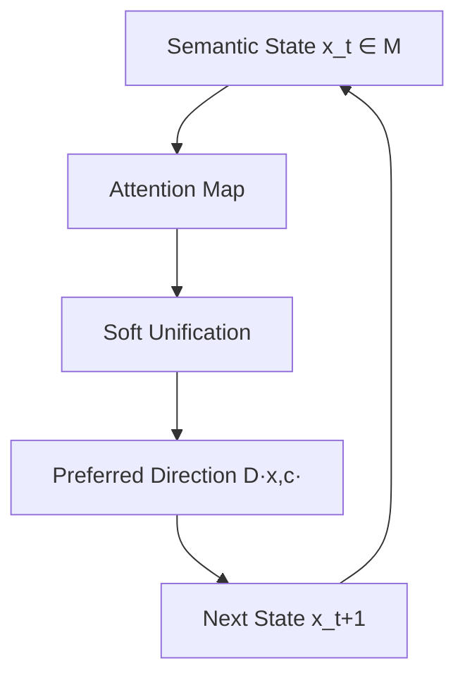
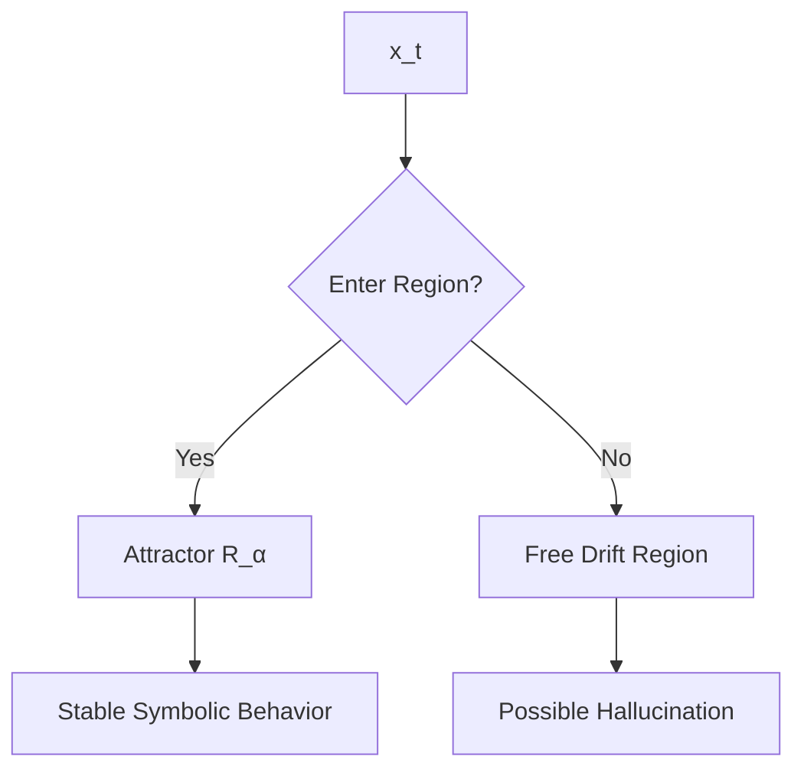

# **Emergent Reasoning in Large Language Models:

A Topological and Constraint-Based Formalization (Version 3)**

---

## **Abstract**

Large Language Models (LLMs) increasingly demonstrate reasoning behaviors that appear to transcend their probabilistic neural foundations. This paper proposes a unified formal framework that explains these behaviors through *topology-constrained traversal* within a learned semantic manifold. We reinterpret the Transformer architecture as a dynamical system whose core computation is a *preferred direction function* — an instance of local preorder traversal on a constraint manifold — implicitly implemented by attention. Context induces constraint sets; embeddings give rise to conceptual topology; attention performs soft, graded unification analogous to symbolic unification; and trajectories over the manifold follow structured flows that manifest as reasoning.

We argue that clusters of embeddings form proto-symbolic attractor regions — Markov objects in the sense of the Constraint-Emergence Ontology — with approximate conditional independence boundaries, enabling symbolic-like behavior to emerge from continuous computations. Hallucinations arise from multiple structural causes: trajectory exit from well-constrained regions, competing attractor interference, and misleading constraint structure. We compare this with Prolog's symbolic unification and show that both paradigms instantiate a shared abstract unification principle — one discrete and explicit, the other continuous and implicit.

Finally, we outline architectural mechanisms for transforming emergent reasoning into *explicit, controllable, modular reasoning*, bridging connectionist and symbolic AI. Recent empirical work — from dynamical systems analyses of transformers to sparse autoencoder decomposition and representation geometry — provides converging support for the framework's core claims. This framework offers a principled understanding of how probabilistic systems yield structured inference, and a foundation for next-generation neuro-symbolic architectures.

---

# **1 Introduction**

The emergence of reasoning-like behavior in Large Language Models challenges traditional dichotomies between symbolic and connectionist AI. These models perform tasks such as:

* multi-step reasoning,
* analogical inference,
* constraint satisfaction,
* factual and relational reasoning, and
* structured problem solving,

despite containing no explicit rules, logic engines, or symbolic manipulators.

This paper argues that the explanatory gap can be closed by reframing LLM computation as *constrained topological traversal* in a learned semantic space.

---

## **1.1 A Constraint-Based Perspective on Reasoning**

Classical constraint satisfaction problems (CSPs) reduce solution space via symbolic constraints:
[
P' = { x \in N : C_1(x) \land C_2(x) \land \cdots \land C_n(x) }.
]

Similarly, in an LLM:

* the input prompt imposes contextual constraints,
* attention weights dynamically enforce relevance constraints, and
* learned embeddings narrow possible semantic continuations.

The Transformer thus performs *constraint-directed computation*.

---

## **1.2 LLMs as Dynamical Systems over a Semantic Manifold**

We introduce a formal model where:

* (M \subset \mathbb{R}^d) is a **semantic manifold**,
* trajectories (x_0, x_1, \dots, x_T \in M) represent **semantic evolution**, and
* the Transformer implements
  [
  x_{t+1} = F(x_t, c_t),
  ]
  where (c_t) is context.

The core computational primitive is:
[
D : M \times \mathcal{C} \to T(M),
]
a **preferred direction function**, implicitly realized by attention.

---

## **1.3 Soft Unification and Emergent Symbolic Structure**

Attention performs weighted matching via similarity:
[
\text{softmax}(QK^\top)V.
]
This constitutes *soft unification*: the continuous analogue of Prolog’s logical unification.

Embedding clusters form attractor-like regions with Markov-blanket-like conditional independence properties. These **proto-symbolic regions** allow discrete-like reasoning to emerge from continuous operations.

---

## **1.4 Contributions**

This paper provides:

1. A formal topological model of LLM computation.
2. A definition of the preferred direction function as an instance of local preorder traversal.
3. A continuous analogue of unification grounded in attention.
4. An attractor-based account of meaning, with a multi-causal hallucination taxonomy.
5. A unification of symbolic and neural reasoning frameworks.
6. Architectural implications for explicit reasoning.
7. Empirical correspondence with recent mechanistic interpretability and representation geometry research (v3).
8. A two-process model of chain-of-thought faithfulness (v3).

---

# **2 Background and Related Work**

This section integrates constraint systems, probabilistic computation, symbolic AI, and modern neural architectures.

---

## **2.1 Constraint Satisfaction and Problem Domains**

A problem domain can be described as:

* A universe of information (N),
* A constrained subset (P \subseteq N),
* A series of constraints (C_i),
* A solution space that shrinks as constraints accumulate.

LLMs exhibit similar behavior: context narrows semantic possibilities.

---

## **2.2 Probabilistic Computation in Brains and Machines**

All physical computation involves noise:

* neurons fire stochastically,
* transistors experience thermal noise,
* quantum fluctuations influence all systems.

Brains and LLMs both implement *probabilistic computation refined by constraints*.

Thus, “LLMs can’t reason because they are probabilistic” is unsound.

---

## **2.3 Transformers and Attention**

Attention is a continuous pattern-matching mechanism:

* Queries select which Keys matter,
* Values transmit semantic information,
* Multi-head attention performs parallel soft constraints.

This parallels symbolic unification in spirit, not mechanism.

---

## **2.4 Markov Blankets and Emergent Boundaries**

Markov blankets define statistical boundaries in probabilistic graphical models.
In LLMs, clustering in embedding space creates regions with high internal coherence and partial independence — candidate Markov boundaries whose precision is an empirical question (see Section 5.3).

These regions behave symbolically.

---

## **2.5 Symbolic Reasoning and Prolog**

Prolog unifies patterns via exact symbolic matching.
LLMs unify via similarity in embedding space.
Both systems:

* match patterns to constraints,
* propagate bindings,
* perform structured inference.

One is discrete, the other continuous.

---

# **3 Foundations: The Semantic Manifold and Directional Flow**

We now introduce the formal mathematical grounding.

---

## **3.1 Semantic Manifold**

Let:

* (M \subseteq \mathbb{R}^d): the set of valid activations of the model.

We interpret:

* each point (x \in M) as a **semantic state**,
* trajectories (x_0, x_1, \dots, x_T) as **reasoning paths**.

---

## **3.2 Constraint Sets**

Context (c) induces a constraint set:
[
\Omega(c) \subseteq M,
]
representing all states consistent with context.

Strongly constrained tasks produce narrow (\Omega(c)).

---

## **3.3 Preferred Direction Function**

### **Definition 1.**

A **preferred direction function** is:
[
D : M \times \mathcal{C} \to T(M),
]
where (T(M)) is the tangent bundle of (M).

The model performs:
[
x_{t+1} = x_t + \Delta t \cdot D(x_t, c_t).
]

This is the *core* of LLM reasoning.

Attention **implements** this function.

### **Relation to Local Preorder Traversal**

The preferred direction function is a specific instance of a universal computational pattern: **local preorder traversal** on a constraint manifold. A constraint network induces a topological preorder — at each point, there exists a locally preferred direction of change. The computational engine that evaluates this preorder is domain-specific:

* **Physics**: Euler-Lagrange equations (least action is the emergent description; the mechanism is local differential equations)
* **LLM training**: gradient descent on loss landscapes
* **LLM inference**: forward field integration through attention — each layer evaluates D(x,c) and advances the state
* **Software engineering**: constraint satisfaction and search over design spaces

In every case, the template is:

> At each point on the manifold, evaluate the local preorder; advance one step; repeat.

The preferred direction function D(x,c) IS the LLM's evaluation of its local preorder. What makes this non-trivial is that training carves the manifold into structured constraint regions, so the preorder is not flat — it has the topology necessary for reasoning.

---

## **3.4 Diagram: Model Overview**

---

# **4 Soft Unification and the Transformer as a Dynamical System**

---

## **4.1 Soft Unification Operator**

Attention computes:
[
U_{\text{soft}}(q) = \sum_i \alpha_i(q,k_i) v_i,
]
with
[
\alpha_i = \frac{e^{\langle q,k_i\rangle/\sqrt{d_k}}}{\sum_j e^{\langle q,k_j\rangle/\sqrt{d_k}}}.
]

This is continuous unification:

* symbolic → discrete substitution,
* soft → similarity-weighted synthesis.

---

## **4.2 Multi-Head Attention as Constraint Composition**

Each head captures:

* relations,
* analogies,
* structural patterns.

Stacked layers → deeper constraints.

---

## **4.3 Directional Dynamics**

Attention biases the direction of semantic flow:
[
D(x,c) = \text{AttnTransformer}(x,c).
]

Thus the Transformer is a **dynamical system**.

---

# **5 Proto-Symbols, Attractors, and Statistical Boundaries**

---

## **5.1 Proto-Symbol Regions**

Clusters in embedding space form regions where:

* trajectories enter and remain stable,
* outputs are semantically narrow,
* internal correlations are strong.

### **Definition 2.**

A region (R_\alpha \subseteq M) is a **proto-symbol** if:

* it is an attractor-like set,
* outputs correspond to consistent semantic categories.

---

## **5.2 Diagram: Attractor Structure**

---

## **5.3 Approximate Markov Boundaries**

Inside (R_\alpha):

* states predict each other well,
* external influence is mediated through boundary states.

This gives symbolic-like integrity.

### **Proto-Symbols as Markov Objects**

The Constraint-Emergence Ontology defines a **Markov object** as a stable pattern with constraint-defined boundaries exhibiting approximate conditional independence from external states. Proto-symbol regions R_α satisfy exactly this definition:

* **Stability**: trajectories that enter R_α tend to remain, producing consistent outputs
* **Boundary**: the transition zone between high internal coherence and external space
* **Conditional independence**: P(internal | boundary, external) ≈ P(internal | boundary), to within tolerance ε

There is empirical evidence that this goes beyond analogy. The Anthropic sparse autoencoder program (Templeton et al. 2024) demonstrates that LLM activation space decomposes into interpretable features with geometric boundaries. These features — monosemantic, steerable, hierarchically organized — are candidate empirical realizations of proto-symbolic Markov objects. Whether they satisfy the full Markov boundary condition depends on the precision of ε.

The **Conditional Independence Conjecture** (Constraint-Emergence Ontology, Part VIII-D) makes the boundary claim testable: ε should decrease with model scale as additional dimensions reduce the need for superposition. This conjecture is directionally supported by superposition theory but not yet directly measured. Falsification: if ε does not decrease with scale, or if monosemantic features show the same ε as polysemantic ones, the Markov object interpretation collapses to loose analogy.

---

# **6 Symbolic Systems and Continuous Systems: A Unified Unification Theory**

---

## **6.1 Prolog’s Discrete Unification**

[
\text{unify}(t_1, t_2) \to \theta \quad \text{or failure}.
]

Search = tree exploration.

---

## **6.2 Transformer’s Continuous Unification**

[
U_{\text{soft}} : \mathbb{R}^d \to \mathbb{R}^d.
]

Inference = manifold flow.

---

## **6.3 Correspondence**

| Prolog          | Transformer                  |
| --------------- | ---------------------------- |
| Terms           | Embeddings                   |
| Unification     | Soft similarity matching     |
| Backtracking    | Parallel weighted evaluation |
| Substitutions   | Continuous blending          |
| Discrete search | Dynamical system trajectory  |

Both instantiate the *same abstract pattern-matching operation* in different computational substrates.

---

# **7 Architectural Implications for Explicit Reasoning**

---

## **7.1 Directional Modulation**

Modify:
[
D_{\text{total}}(x,c) = D_{\text{base}} + \sum_k D_{\text{constraint}}^{(k)}.
]

Sources of (D_{\text{constraint}}):

* symbolic validators,
* type systems,
* tool outputs,
* RL reward shaping,
* retrieval grounding.

---

## **7.2 Topology-Aware Regularization**

Encourage:

* clean attractors,
* clear boundaries,
* valid trajectories.

Penalize:

* drift into weak regions,
* wandering away from grounding.

---

## **7.3 Hybrid Neuro-Symbolic Systems**

Symbolic components define tighter constraint sets:
[
\Omega_{\text{sym}}(c).
]

These reshape the manifold traversal.

---

# **8 Conclusion**

We have argued that LLM reasoning emerges from:

* semantic manifolds with trained constraint structure,
* constraint-induced subspaces that narrow semantic possibility,
* attention-mediated direction fields implementing local preorder traversal,
* proto-symbolic attractors that function as Markov objects with approximate conditional independence boundaries.

Since Version 2, several developments strengthen and refine the framework:

1. **Grounding in broader ontology**: The preferred direction function D(x,c) is not an ad hoc formalization but an instance of local preorder traversal — the same computational primitive that appears across physics, optimization, and software engineering (Constraint-Emergence Ontology, Part VIII-C).

2. **Empirical convergence**: Independent research programs — dynamical systems analysis of transformers (Geshkovski et al.), sparse autoencoder decomposition (Templeton et al.), representation geometry (Engels et al., Marks & Tegmark), and function vectors (Todd et al.) — provide converging support for the framework's core claims (Section 9).

3. **Refined hallucination account**: Hallucination is multi-causal — sparse regions, wrong attractors, competing attractors, and know-generate gaps — not simply "chaotic excursion" (Appendix A.3).

4. **CoT observability limits**: Chain-of-thought does not reliably externalize the internal traversal. The verbalization process is a separate trajectory with variable fidelity, particularly under RL training pressure (Appendix A.5).

5. **Testable predictions**: The Conditional Independence Conjecture provides explicit falsification criteria for the Markov object interpretation, measurable with current interpretability tools.

This framework unifies symbolic and neural accounts and provides a principled basis for building explicit reasoning modules. The key open question is whether the category-theoretic formalization (the Constraint Functor) can be made rigorous enough to generate novel predictions — moving from structural correspondence to mathematical proof.

---

# **Appendix A: Deeper Background on Topology, Computation, and Reasoning**

This appendix contains deeper discussions that exceed the main paper’s constraints.

---

## **A.1 The Fundamental Computation: Local Preorder Traversal**

Given a constraint-induced topology, the only primitive computation is the evaluation of the local preorder:
[
D(x,c),
]
the preferred direction at each point.

Everything else — optimization, inference, reasoning — is emergent trajectory behavior. This is not specific to LLMs: physics (Euler-Lagrange), machine learning (gradient descent), and LLM inference (attention-mediated forward flow) all instantiate the same template. The preferred direction function is the LLM-specific implementation of a substrate-independent computational primitive (see Constraint-Emergence Ontology, Part VIII-C).

---

## **A.2 Attractors as Meaning Structures**

Semantic stability = attractor.
Symbolic meaning = stable manifold.

---

## **A.3 Hallucination: A Multi-Causal Taxonomy**

Version 2 characterized hallucination as "chaotic excursion" into underconstrained regions. Empirical evidence (Burns et al. 2023, Kuhn et al. 2024, Li et al. 2023) reveals a richer picture. Hallucinations arise from at least four distinct structural causes:

1. **Sparse constraint regions** — the manifold lacks relevant attractor structure (the model never learned the fact). The trajectory drifts through weakly constrained space, generating fluent but ungrounded output.

2. **Wrong attractors** — the manifold contains misleading constraint structure (the model "learned" a false association from training data). The trajectory converges confidently to an incorrect attractor basin. This produces *structured, reproducible* hallucination — the opposite of chaotic excursion.

3. **Competing attractors** — multiple inconsistent constraint sources pull the trajectory in different directions (e.g., irrelevant context interfering with relevant context). The trajectory oscillates or settles on the stronger but incorrect attractor. Shi et al. (2023) demonstrate this empirically.

4. **Know-generate gap** — the correct attractor exists in activation space, but the generation trajectory fails to stay within it. Burns et al. (2023) show that linear probes can extract correct facts from internal states even when the model's output hallucinates — trajectory instability in its most literal form.

**Grounding mechanisms** (RAG, tool use, chain-of-verification) work by adding boundary conditions that stabilize the trajectory: retrieval narrows Ω(c), tool outputs impose hard constraints, and verification re-enters the semantic region with tighter constraint sets. The finding that bad retrieval *increases* hallucination (Lewis et al. 2020; Shi et al. 2023) is predicted: incorrect boundary conditions push the trajectory toward wrong attractors.

**Semantic entropy** (Kuhn et al. 2024) provides a direct empirical proxy for attractor basin structure: high semantic entropy = multiple trajectories from the same starting point diverge into different semantic regions = no dominant attractor. Low semantic entropy = trajectories converge = stable attractor.

---

## **A.4 Category-Theoretic Interpretation**

* Embeddings = objects in an enriched category
* Attention = enriched morphisms
* Reasoning = sequence of morphisms forming a path
* Proto-symbol regions = limits or terminal objects

### **The Constraint Functor**

The Constraint-Emergence Ontology (Part VIII-D) formalizes this interpretation as a **Constraint Functor** between physical and computational Markov objects. The core claim: there exists a structure-preserving map (functor) between the category of physical Markov objects and the category of LLM Markov objects, such that:

* Stable physical entities map to stable attractor basins
* Physical boundaries map to feature boundaries (approximate conditional independence)
* Physical transitions map to attention-mediated transitions

A world model is a **functor from a schema category** to the LLM category. The correspondence between a world model and the physical world it models is a **natural transformation** between two functors. Alignment is the question of whether this natural transformation commutes — a misaligned world model is one where the transformation fails at specific morphisms.

This formalization elevates the proto-symbolic account from analogy to testable structural claim (see Section 5.3 and Appendix A.5).

---

## **A.5 Chain-of-Thought: Observability and Faithfulness**

Version 2 implicitly assumed that chain-of-thought (CoT) externalizes the internal manifold traversal — each verbalized step corresponding to a visible morphism. Recent work (Anthropic 2025, OpenAI 2025, Turpin et al. 2023, Lanham et al. 2023) demonstrates that this assumption is too strong.

**The empirical picture**: CoT is not always a faithful externalization of internal computation. Models frequently use information (hints, biases, shortcuts) without acknowledging it in their reasoning traces. RL training on outcome-based rewards can *decrease* CoT faithfulness — models learn to produce correct answers while generating sanitized reasoning traces.

**The two-process refinement**: In the manifold traversal framework, CoT generation is itself a *separate traversal* that may or may not correspond to the reasoning traversal:

* The **reasoning traversal** follows the constraint landscape of the problem — D(x,c) evaluated against problem structure
* The **verbalization traversal** follows the constraint landscape of "what constitutes a good explanation" — influenced by social norms, training rewards, sycophantic pressures

These two traversals operate on overlapping but distinct regions of the manifold. When the constraint coupling between them is strong (well-constrained domains like mathematical proofs with canonical step sequences), CoT is approximately faithful. When coupling is weak (strategic reasoning, social judgment, adversarial pressure), CoT can diverge substantially from the actual computation.

**Predictions from the framework**:

* **Domain dependence of faithfulness**: Mathematical reasoning should be more faithful than social/strategic reasoning (supported by OpenAI 2025)
* **RL pressure decouples trajectories**: Training against CoT monitors should produce obfuscation rather than alignment (supported by OpenAI 2025)
* **Internal representations remain reliable**: Even when CoT is unfaithful, activation-level probes should still reflect the actual computation (consistent with Burns et al. 2023, Li et al. 2023)

This refinement is philosophically consistent with the Constraint-Emergence Ontology's core principle that descriptions (laws, explanations, verbalizations) are cognitive tools, not the computation itself. The unfaithful CoT literature is an empirical instance of the laws ≠ substrate distinction.

---

# **9 Empirical Correspondence (v3 addition)**

Since Version 2, a converging body of empirical work has provided independent support for this framework's core claims. This section maps the correspondence.

---

## **9.1 Manifold Structure**

| Claim | Supporting evidence |
|-------|-------------------|
| M ⊆ ℝ^d has manifold structure | Engels et al. 2024: non-linear (circular, toroidal) features in LLMs. Gurnee & Tegmark 2024: linear representations of space and time. Aghajanyan et al. 2021: low intrinsic dimensionality of fine-tuning landscapes. |
| Proto-symbolic attractor regions | Geshkovski et al. 2023, 2024: mathematical proof that self-attention dynamics produce clustering/collapse into metastable states. Templeton et al. 2024: 34M interpretable features from sparse autoencoders on Claude 3 Sonnet. |
| Markov-blanket-like boundaries | Elhage et al. 2022: superposition geometry predicts interference (ε) from dimension-to-feature ratio. Cunningham et al. 2024: feature activation locality. Geiger et al. 2024: causal abstraction with quantifiable alignment error. |

## **9.2 Preferred Direction Function**

| Claim | Supporting evidence |
|-------|-------------------|
| D(x,c) as core computation | von Oswald et al. 2023: transformer forward passes implement gradient descent steps — direction = negative gradient. Todd et al. 2024: function vectors as context-dependent direction vectors (empirical D(x,c)). |
| Directional modulation D_total = D_base + D_constraint | Zou et al. 2023: representation engineering — concept directions steer behavior. Turner et al. 2023: activation addition as direction modification. Li et al. 2023: inference-time intervention via truthfulness direction. |
| Reasoning as extended traversal | Feng et al. 2023: CoT extends trajectory length, enabling problems beyond inherent depth. Snell et al. 2024: test-time compute scaling substitutes for model scaling. Goyal et al. 2024: pause tokens = extra forward passes = better reasoning. |

## **9.3 Trajectory Visualization**

Belrose et al. 2023 (tuned lens) directly visualizes the manifold traversal: each layer moves the representation along a trajectory, and predictions refine progressively across layers, converging toward the final output. This is the empirical realization of the trajectory picture in Sections 3-4.

## **9.4 What is Novel in This Framework**

The empirical results above were produced independently, in different research programs, using different theoretical languages. This framework's contribution is the *synthesis*:

1. **D: M × C → T(M)** — the tangent bundle formalization of the preferred direction function. No published work formalizes direction vectors this way.
2. **Constraint satisfaction framing** — reinterpreting LLM computation as CSP-like constraint narrowing. The literature uses "geometric" language; the constraint framing is original.
3. **Proto-symbol + Markov boundary synthesis** — connecting SAE features, attractor dynamics, and conditional independence into a single account.
4. **Prolog soft unification correspondence** — the mapping between symbolic and continuous unification (Section 6).
5. **Multi-causal hallucination taxonomy** — distinguishing sparse, wrong, competing, and know-generate gap causes within the trajectory framework (Appendix A.3).
6. **CoT two-process model** — separating reasoning traversal from verbalization traversal (Appendix A.5).

## **9.5 Open Questions**

* **Conditional Independence Conjecture**: No published work has directly measured ε across model scales as the conjecture specifies. The prediction is directionally supported by superposition theory but unverified.
* **Functor rigor**: The category-theoretic formalization (Appendix A.4) remains a structural sketch. Making the functors precise requires formal connection between SAE feature boundaries and Friston's Markov blanket formalism.
* **Linear vs. manifold**: The linear representation hypothesis (Park et al. 2024) suggests many features are linearly encoded. Engels et al. 2024 shows some are genuinely non-linear. The manifold picture may be an overspecification for the linear cases and a necessity for the non-linear ones.

---

# **References**

Aghajanyan, A., et al. (2021). Intrinsic Dimensionality Explains the Effectiveness of Language Model Fine-Tuning. ACL 2021.

Allen-Zhu, Z. & Li, Y. (2024). Physics of Language Models (series). arXiv.

Anthropic. (2025). Reasoning Models Don't Always Say What They Think. arXiv:2505.05410.

Belrose, N., et al. (2023). Eliciting Latent Predictions from Transformers with the Tuned Lens. arXiv.

Burns, C., et al. (2023). Discovering Latent Knowledge in Language Models Without Supervision. ICLR 2023.

Cunningham, H., et al. (2024). Sparse Autoencoders Find Highly Interpretable Features in Language Models. arXiv.

Elhage, N., et al. (2022). Toy Models of Superposition. Anthropic.

Engels, J., et al. (2024). Not All Language Model Features Are Linear. arXiv:2405.14860.

Feng, G., et al. (2023). Towards Revealing the Mystery behind Chain of Thought. NeurIPS 2023.

Geiger, A., et al. (2024). Causal Abstraction for Faithful Model Interpretation. arXiv.

Geshkovski, B., et al. (2023). A Mathematical Perspective on Transformers. arXiv:2312.10794.

Geshkovski, B., et al. (2024). The Emergence of Clusters in Self-Attention Dynamics. NeurIPS 2024.

Goyal, S., et al. (2024). Think Before You Speak: Training Language Models With Pause Tokens. ICLR 2024.

Gurnee, W. & Tegmark, M. (2024). Language Models Represent Space and Time. ICLR 2024.

Kuhn, L., Gal, Y. & Farquhar, S. (2024). Semantic Entropy. ICLR 2024.

Lanham, T., et al. (2023). Measuring Faithfulness in Chain-of-Thought Reasoning. arXiv:2307.13702.

Lewis, P., et al. (2020). Retrieval-Augmented Generation for Knowledge-Intensive NLP Tasks. NeurIPS 2020.

Li, K., et al. (2023). Inference-Time Intervention: Eliciting Truthful Answers from a Language Model. NeurIPS 2023.

Marks, S. & Tegmark, M. (2024). The Geometry of Truth. arXiv.

Park, K., Choe, Y.J. & Veitch, V. (2024). The Linear Representation Hypothesis and the Geometry of Large Language Models. arXiv:2311.03658.

OpenAI. (2025). Monitoring Reasoning Models for Misbehavior. arXiv:2503.11926.

OpenAI. (2025). Evaluating the Monitorability of Reasoning Models. arXiv:2512.18311.

Shi, F., et al. (2023). Large Language Models Can Be Easily Distracted by Irrelevant Context. ICML 2023.

Snell, C., et al. (2024). Scaling LLM Test-Time Compute. arXiv:2408.03314.

Templeton, A., et al. (2024). Scaling Monosemanticity: Extracting Interpretable Features from Claude 3 Sonnet. Anthropic. arXiv:2406.04093.

Todd, E., et al. (2024). Function Vectors in Large Language Models. ICLR 2024.

Turner, A., et al. (2023). Activation Addition: Steering Language Models Without Optimization. arXiv:2308.10248.

Turpin, M., et al. (2023). Language Models Don't Always Say What They Think. NeurIPS 2023.

von Oswald, J., et al. (2023). Transformers Learn In-Context by Gradient Descent. ICML 2023.

Ye, J., et al. (2024). Diffusion of Thoughts: Chain-of-Thought Reasoning in Diffusion Language Models. arXiv:2402.07754.

Zou, A., et al. (2023). Representation Engineering: A Top-Down Approach to AI Transparency. arXiv:2310.01405.

