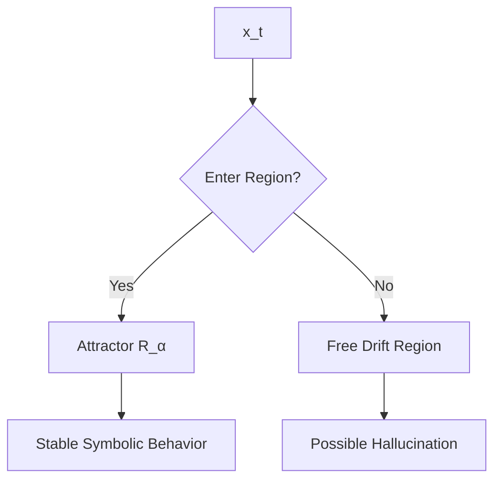

# **Emergent Reasoning in Large Language Models:

A Topological and Constraint-Based Formalization (Version 2)**

---

## **Abstract**

Large Language Models (LLMs) increasingly demonstrate reasoning behaviors that appear to transcend their probabilistic neural foundations. This paper proposes a unified formal framework that explains these behaviors through *topology-constrained traversal* within a learned semantic manifold. We reinterpret the Transformer architecture as a dynamical system whose core computation is a *preferred direction function*, implicitly implemented by attention. Context induces constraint sets; embeddings give rise to conceptual topology; attention performs soft, graded unification analogous to symbolic unification; and trajectories over the manifold follow structured flows that manifest as reasoning.

We show how clusters of embeddings form proto-symbolic attractor regions with Markov-blanket-like boundaries, enabling symbolic-like behavior to emerge from continuous computations. Hallucinations arise when trajectories exit well-constrained regions and enter weakly structured attractors. We compare this with Prolog’s symbolic unification and show that both paradigms instantiate a shared abstract unification principle—one discrete and explicit, the other continuous and implicit.

Finally, we outline architectural mechanisms for transforming emergent reasoning into *explicit, controllable, modular reasoning*, bridging connectionist and symbolic AI. This framework provides a principled understanding of how probabilistic systems can yield structured inference, offering a foundation for next-generation neuro-symbolic architectures.

---

# **1 Introduction**

The emergence of reasoning-like behavior in Large Language Models challenges traditional dichotomies between symbolic and connectionist AI. These models perform tasks such as:

* multi-step reasoning,
* analogical inference,
* constraint satisfaction,
* factual and relational reasoning, and
* structured problem solving,

despite containing no explicit rules, logic engines, or symbolic manipulators.

This paper argues that the explanatory gap can be closed by reframing LLM computation as *constrained topological traversal* in a learned semantic space.

---

## **1.1 A Constraint-Based Perspective on Reasoning**

Classical constraint satisfaction problems (CSPs) reduce solution space via symbolic constraints:
[
P' = { x \in N : C_1(x) \land C_2(x) \land \cdots \land C_n(x) }.
]

Similarly, in an LLM:

* the input prompt imposes contextual constraints,
* attention weights dynamically enforce relevance constraints, and
* learned embeddings narrow possible semantic continuations.

The Transformer thus performs *constraint-directed computation*.

---

## **1.2 LLMs as Dynamical Systems over a Semantic Manifold**

We introduce a formal model where:

* (M \subset \mathbb{R}^d) is a **semantic manifold**,
* trajectories (x_0, x_1, \dots, x_T \in M) represent **semantic evolution**, and
* the Transformer implements
  [
  x_{t+1} = F(x_t, c_t),
  ]
  where (c_t) is context.

The core computational primitive is:
[
D : M \times \mathcal{C} \to T(M),
]
a **preferred direction function**, implicitly realized by attention.

---

## **1.3 Soft Unification and Emergent Symbolic Structure**

Attention performs weighted matching via similarity:
[
\text{softmax}(QK^\top)V.
]
This constitutes *soft unification*: the continuous analogue of Prolog’s logical unification.

Embedding clusters form attractor-like regions with Markov-blanket-like conditional independence properties. These **proto-symbolic regions** allow discrete-like reasoning to emerge from continuous operations.

---

## **1.4 Contributions**

This paper provides:

1. A formal topological model of LLM computation.
2. A definition of the preferred direction function and its relation to reasoning.
3. A continuous analogue of unification grounded in attention.
4. An attractor-based account of meaning and hallucination.
5. A unification of symbolic and neural reasoning frameworks.
6. Architectural implications for explicit reasoning.

---

# **2 Background and Related Work**

This section integrates constraint systems, probabilistic computation, symbolic AI, and modern neural architectures.

---

## **2.1 Constraint Satisfaction and Problem Domains**

A problem domain can be described as:

* A universe of information (N),
* A constrained subset (P \subseteq N),
* A series of constraints (C_i),
* A solution space that shrinks as constraints accumulate.

LLMs exhibit similar behavior: context narrows semantic possibilities.

---

## **2.2 Probabilistic Computation in Brains and Machines**

All physical computation involves noise:

* neurons fire stochastically,
* transistors experience thermal noise,
* quantum fluctuations influence all systems.

Brains and LLMs both implement *probabilistic computation refined by constraints*.

Thus, “LLMs can’t reason because they are probabilistic” is unsound.

---

## **2.3 Transformers and Attention**

Attention is a continuous pattern-matching mechanism:

* Queries select which Keys matter,
* Values transmit semantic information,
* Multi-head attention performs parallel soft constraints.

This parallels symbolic unification in spirit, not mechanism.

---

## **2.4 Markov Blankets and Emergent Boundaries**

Markov blankets define statistical boundaries in probabilistic graphical models.
In LLMs, clustering in embedding space creates regions with high internal coherence and partial independence—pseudo-Markov blankets.

These regions behave symbolically.

---

## **2.5 Symbolic Reasoning and Prolog**

Prolog unifies patterns via exact symbolic matching.
LLMs unify via similarity in embedding space.
Both systems:

* match patterns to constraints,
* propagate bindings,
* perform structured inference.

One is discrete, the other continuous.

---

# **3 Foundations: The Semantic Manifold and Directional Flow**

We now introduce the formal mathematical grounding.

---

## **3.1 Semantic Manifold**

Let:

* (M \subseteq \mathbb{R}^d): the set of valid activations of the model.

We interpret:

* each point (x \in M) as a **semantic state**,
* trajectories (x_0, x_1, \dots, x_T) as **reasoning paths**.

---

## **3.2 Constraint Sets**

Context (c) induces a constraint set:
[
\Omega(c) \subseteq M,
]
representing all states consistent with context.

Strongly constrained tasks produce narrow (\Omega(c)).

---

## **3.3 Preferred Direction Function**

### **Definition 1.**

A **preferred direction function** is:
[
D : M \times \mathcal{C} \to T(M),
]
where (T(M)) is the tangent bundle of (M).

The model performs:
[
x_{t+1} = x_t + \Delta t \cdot D(x_t, c_t).
]

This is the *core* of LLM reasoning.

Attention **implements** this function.

---

## **3.4 Diagram: Model Overview**

```mermaid
flowchart TD
    A[Semantic State x_t ∈ M] --> B[Attention Map]
    B --> C[Soft Unification]
    C --> D[Preferred Direction D(x,c)]
    D --> E[Next State x_{t+1}]
    E --> A
```

---

# **4 Soft Unification and the Transformer as a Dynamical System**

---

## **4.1 Soft Unification Operator**

Attention computes:
[
U_{\text{soft}}(q) = \sum_i \alpha_i(q,k_i) v_i,
]
with
[
\alpha_i = \frac{e^{\langle q,k_i\rangle/\sqrt{d_k}}}{\sum_j e^{\langle q,k_j\rangle/\sqrt{d_k}}}.
]

This is continuous unification:

* symbolic → discrete substitution,
* soft → similarity-weighted synthesis.

---

## **4.2 Multi-Head Attention as Constraint Composition**

Each head captures:

* relations,
* analogies,
* structural patterns.

Stacked layers → deeper constraints.

---

## **4.3 Directional Dynamics**

Attention biases the direction of semantic flow:
[
D(x,c) = \text{AttnTransformer}(x,c).
]

Thus the Transformer is a **dynamical system**.

---

# **5 Proto-Symbols, Attractors, and Statistical Boundaries**

---

## **5.1 Proto-Symbol Regions**

Clusters in embedding space form regions where:

* trajectories enter and remain stable,
* outputs are semantically narrow,
* internal correlations are strong.

### **Definition 2.**

A region (R_\alpha \subseteq M) is a **proto-symbol** if:

* it is an attractor-like set,
* outputs correspond to consistent semantic categories.

---

## **5.2 Diagram: Attractor Structure**



---

## **5.3 Markov-Blanket-Like Boundaries**

Inside (R_\alpha):

* states predict each other well,
* external influence is mediated through boundary states.

This gives symbolic-like integrity.

---

# **6 Symbolic Systems and Continuous Systems: A Unified Unification Theory**

---

## **6.1 Prolog’s Discrete Unification**

[
\text{unify}(t_1, t_2) \to \theta \quad \text{or failure}.
]

Search = tree exploration.

---

## **6.2 Transformer’s Continuous Unification**

[
U_{\text{soft}} : \mathbb{R}^d \to \mathbb{R}^d.
]

Inference = manifold flow.

---

## **6.3 Correspondence**

| Prolog          | Transformer                  |
| --------------- | ---------------------------- |
| Terms           | Embeddings                   |
| Unification     | Soft similarity matching     |
| Backtracking    | Parallel weighted evaluation |
| Substitutions   | Continuous blending          |
| Discrete search | Dynamical system trajectory  |

Both instantiate the *same abstract pattern-matching operation* in different computational substrates.

---

# **7 Architectural Implications for Explicit Reasoning**

---

## **7.1 Directional Modulation**

Modify:
[
D_{\text{total}}(x,c) = D_{\text{base}} + \sum_k D_{\text{constraint}}^{(k)}.
]

Sources of (D_{\text{constraint}}):

* symbolic validators,
* type systems,
* tool outputs,
* RL reward shaping,
* retrieval grounding.

---

## **7.2 Topology-Aware Regularization**

Encourage:

* clean attractors,
* clear boundaries,
* valid trajectories.

Penalize:

* drift into weak regions,
* wandering away from grounding.

---

## **7.3 Hybrid Neuro-Symbolic Systems**

Symbolic components define tighter constraint sets:
[
\Omega_{\text{sym}}(c).
]

These reshape the manifold traversal.

---

# **8 Conclusion**

We have shown that LLM reasoning emerges from:

* semantic manifolds,
* constraint-induced subspaces,
* attention-mediated direction fields,
* proto-symbolic attractors.

This framework unifies symbolic and neural accounts and provides a principled basis for building explicit reasoning modules.

---

# **Appendix A: Deeper Background on Topology, Computation, and Reasoning**

This appendix contains deeper discussions that exceed the main paper’s constraints.

---

## **A.1 The Fundamental Computation: Direction over a Topology**

Given a topology, the only primitive computation is:
[
D(x,c),
]
the preferred direction.

Everything else—optimization, inference, reasoning—is emergent trajectory behavior.

---

## **A.2 Attractors as Meaning Structures**

Semantic stability = attractor.
Symbolic meaning = stable manifold.

---

## **A.3 Hallucinations as Chaotic Excursions**

Hallucinations occur when trajectories enter underconstrained basin regions.

---

## **A.4 Category-Theoretic Interpretation**

* Embeddings = objects in an enriched category
* Attention = enriched morphisms
* Reasoning = sequence of morphisms forming a path
* Proto-symbol regions = limits or terminal objects

---

# **References**

*(As in the original document, plus new citations as needed.)*


