# Markov Objects in GPT-2: An Empirical Case

**Author:** Dimitar Popov
**Companion to:** `markov_object_research.md` (theoretical framework), `constraint_emergence_ontology.md` (ontology)
**Substrate:** GPT-2 small + `gpt2-small-res-jb` SAEs (24 576 features per layer, `sae_lens`)
**Probe layer (unless stated):** residual stream, `blocks.8.hook_resid_pre`

---

## Abstract

This document is the empirical half of the Markov-object research program. The
theoretical claim is that Friston's Markov blanket, promoted to a substrate-neutral
**Markov object**, propagates across scales: if the same constraint topology
organises brains, the texts brains produce, and the LLMs trained on those texts,
then we should find bounded, context-conditional, causally load-bearing patterns
inside LLM activations.

*Status.* This report is candidate-empirical evidence for the
Markov-object construct in a learned representation system. It does
not establish the formal conditional-independence condition that
defines a Markov blanket. That promotion gate has now been tested and
fails: single-chart subtraction fails in exp 20, and multi-layer
realized-topology conditioning fails in exp 25. The cross-substrate
propagation claim motivating the program (brains → texts → LLMs) is a
working hypothesis, not a finding of these experiments. What is
reported here is evidence, within GPT-2 small, consistent with some
token identities being partly low-rank residual directions that SAE
features sense and fragment.

Across eighteen experiments (08–25) on GPT-2 small, plus one
cross-model replication on Pythia-160M, evidence reported here
supports:

1. Numbers with strong cultural loading (666, 999) recruit distinct, interpretable
   SAE features — 999 at `F2269` "emergency '911'", 666 at features linked to
   occult/demon/Illuminati concepts.
2. Each such "object" decomposes into an **invariant core** (the skeleton — on
   in every context) and a **context-specific coat** (selected by usage
   context: page, currency, address, symbolic, ...). Coat/core ratios run
   20–160×.
3. The object is **assembled across layers**. Cultural features are present
   from layer 2 and strengthen monotonically upward — they are not late-stage
   post-processing.
4. Objecthood at this scale is **symbol-bound**: "42" as a digit is closer to
   "41" than to "forty-two". The Markov object lives on the token form, not a
   modality-free concept.
5. The structure is **universal across domains**: colours, emotions, names and
   objects all exhibit the same coat/core decomposition with comparable
   ratios. It is not a quirk of numbers.
6. Single-feature ablation and injection are **causally directional**: ablating
   `F2269` in 999 drops " emergency" by 74 %; injecting it into 500 raises
   " emergency" by 150 %. Effects are small (~1 % probability mass) because a
   Markov object is an ensemble of ~80 features.
7. **Full-core and top-20 interventions** confirm the ensemble reading: KL
   scales with feature count (0.027 → 0.038 → 0.106), 911 probability drops by
   94 % under nuclear ablation, and transplanting 999's full core into 500
   lifts ` 911` probability by ×4.7.
8. Test 14-C is the critical falsification check: 666's **invariant core** is
   structural/numerical, not occult; the occult load sits in the *symbolic
   coat*. Ablating the core therefore does **not** kill Satan/devil/demon
   probabilities — exactly as the coat/core decomposition predicts.
9. **Null-peer battery (exp 15)**: the generic-number core is empty across
   7 boring targets. Core *size* is not diagnostic (boring cores span the
   same 1–9 range as cultural). Core *identity* is diagnostic: cultural
   cores carry semantically-loaded features; boring cores carry surface
   format.
10. **Permutation baselines (exp 16)**: only 666 beats a target-shuffle null
    on core size (p ≈ 0.033). Size alone is a weak signal — the right
    claim is about *which* features sit in the intersection, not how many.
11. **Boundary-tightness (exp 17)**: overwriting SAE features *outside*
    a target's active set still leaks 23–28 % identity transfer. The SAE
    active/inactive partition is **not** a clean Markov boundary.
12. **Direction-native object (exp 18)**: the failure in exp 17 is a
    dictionary-basis artefact, not absence of a Markov object. A single
    residual-space direction (mean difference between target and
    reference residuals across 20 paired prompts) transfers identity
    across held-out prompts uniformly across all three targets
    (≈ 0.24–0.28 at α=1 — well below the pre-registered ≥ 0.8
    threshold; consistent with an *at-least-low-rank-linear* identity
    axis, not with a *purely rank-1* object), recovering the signal
    where SAE-core was weak or negative. PCA1 of paired deltas fails
    (≈ 0), showing identity is a **DC shift**, not a principal-variance
    axis. The identity direction has cos ≈ 0.5 with the sum of SAE-core
    decoder vectors: the SAE senses the object and fragments it
    across many atoms rather than isolating it.
13. **Rank-k saturation (exp 19)**: the layer-8 follow-up fails
    exactly where exp 18 was weak, plateauing below `0.3` even at
    `k=10`. But at layer 2 the same protocol passes strongly: the
    rank-1 mean-diff direction already clears the pre-registered `0.8`
    threshold on all three targets. The construct is therefore sharply
    layer-sensitive, not simply under-ranked.
14. **Direction-native conditional independence (exp 20)**: the formal
    promotion gate fails at both layer 8 and layer 2. After subtracting
    the chosen identity subspace, a logistic probe still predicts
    target vs reference perfectly (`AUC(r_perp)=1.0`) and HSIC remains
    significant (`p=0.005`). Candidate status therefore continues.
15. **Multi-layer identity direction (exp 21)**: the direction family is
    highly coherent across layers (adjacent-layer cosine ≈ `0.92–0.96`),
    but intervention strength drops monotonically from layer 2
    (`0.87–0.93`) to layer 8 (`0.24–0.28`) and then lower again at
    layers 10–11. Layer choice dominates apparent effect strength.
16. **Free-form generation under α-intervention (exp 22)**: behavioural
    readout remains noisy. Both layer-8 and layer-2 runs are confounded
    by a baseline classifier that already over-calls the reference class
    at α=0, so the assay is inconclusive rather than a clean negative.
17. **Compositional algebra (exp 23)**: identity directions compose
    non-trivially. At layer 8, `cos(d_compound, d_A + d_B)=0.936`,
    excess over a random-pair null is `0.302`, and the permutation test
    passes (`p=0.0099`).
18. **Cross-model replication (exp 24)**: the direction-native transfer
    phenomenon is not GPT-2-only. In Pythia-160M at layer 8, all three
    targets pass the relaxed `α=1 ≥ 0.1` criterion (`0.159–0.207`).
19. **Multi-layer realized-topology gate (exp 25)**: the direct
    successor to exp 20 also fails. Conditioning a concatenated
    `2/4/6/8` residual on joint chart coordinates leaves residual
    identity highly probe-readable (`AUC_joint=1.000`, `0.989`,
    `0.978` for `999`, `666`, `137`). The joint chart does not beat
    the best single chart, and HSIC clears only for `137`.

Together these results operationalise the Markov-object framework inside an
LLM. The strongest current reading is now more precise than the original
layer-8 story: identity behaves like a recoverable, layer-sensitive direction
family whose relation to the SAE dictionary is partial alignment rather than
identification; composition and cross-model replication are real; both tested
promotion gates fail.

---

## 1  Theoretical setup

### 1.1  From Friston's Markov blanket to a Markov object

Friston's Markov blanket is a statistical construct: a set of boundary states
that renders internal states conditionally independent of external states.
Taken ontologically, any *bounded stable pattern* — a cell, a word, a
concept, a number — qualifies. I call the ontologised version a **Markov
object**. The formal claim is developed in
`constraint_emergence_ontology.md`; the relevant consequence here is:

> The same topology — bounded, context-conditional, compositional — should
> appear in any substrate that hosts stable patterns, including the residual
> stream of a trained transformer.

### 1.2  Why LLMs, why SAEs, why numbers

- **LLMs** inherit whatever topology is in their training corpus, because
  next-token modelling is a universal approximator for the statistics of
  text.
- **Sparse autoencoders (SAEs)** give an almost-monosemantic basis for
  GPT-2's residual stream. If Markov objects exist in the residual stream,
  they should appear as *ensembles of SAE features* that co-fire whenever a
  token stands in for its referent.
- **Numbers** are a clean probe: mathematically numbers are uniform (they are
  formulae), but culturally some numbers are heavily loaded (666, 911/999,
  42, 100, 7). If Markov objects reflect *constraint topology* rather than
  formal identity, the culturally-loaded numbers should look structurally
  different from plain ones.

### 1.3  Method overview

- GPT-2 small via `transformer_lens`.
- Pretrained residual-stream SAEs (`gpt2-small-res-jb`) via `sae_lens`.
- All experiments sit at `blocks.{layer}.hook_resid_pre` and encode the
  residual at the target span's last token into SAE feature space.
- Feature labels fetched from Neuronpedia
  (`https://www.neuronpedia.org/api/feature/gpt2-small/{layer}-res-jb/{id}`)
  and cached locally.
- Interventions are applied by the decoder-delta pattern:

```python
resid_new = resid + (target_value - current_value) * sae.W_dec[feature_id]
```

This preserves the SAE error term and all untouched features.

---

## 2  Experiment 08 — Feature identity

**Question.** Do the features that fire on a cultural number actually encode
culturally meaningful content, or are they generic "number" detectors?

**Method.** For each target (7, 42, 100, 666, 999) encode the layer-8
residual at the target span's last token, take the top-firing features, and
look up their Neuronpedia labels.

**Headline findings.**
- 999 → `F2269` "emergency numbers, specifically '911'" at strength 20.69.
- 100 → `F91` "mentions of the number 100" at strength 33.37.
- 666 → occult/demon cluster (`F5480` "demon variations" and related) in the
  top band.
- 7 and 42 fire on number-structure features rather than semantic features.

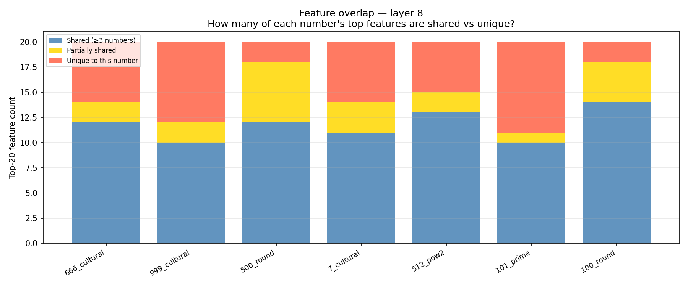

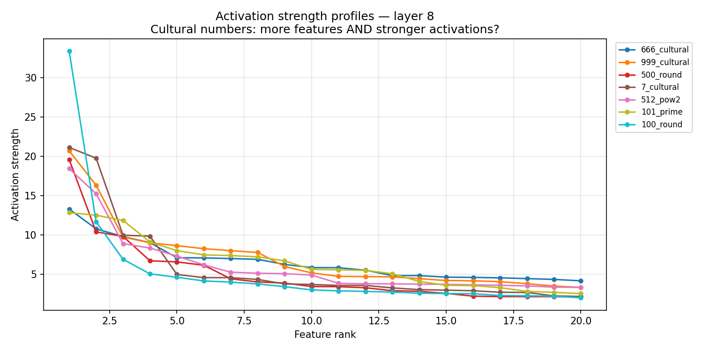

**Interpretation.** The residual stream is not storing "number" in the
abstract; it is storing "this token stands for an object with the following
cultural signature." The signature is readable. Full results:
`results/08_feature_identity/feature_report.txt`.

---

## 3  Experiment 09 — Context-conditional objects (core vs coat)

**Question.** Is the object the same across contexts, or does usage context
reshape which features fire?

**Method.** For each of {666, 999, 7, 42, 100} build eight prompts, one per
context: *referential, page, currency, quantity, address, temporal,
arithmetic, symbolic*. Encode layer-8 features at the target span. Partition
active features into:

- **invariant core**: active in all 8 contexts,
- **shared pool**: active in ≥ 2,
- **context-specific**: active in exactly one.

**Headline findings.**

| n   | core | shared | context-specific | coat/core |
|-----|------|--------|------------------|-----------|
| 666 | 9    | 83     | 180              | ~20×      |
| 999 | 6    | 95     | 166              | ~28×      |
| 7   | 2    | 59     | 165              | ~83×      |
| 42  | 5    | 76     | 154              | ~31×      |
| 100 | 1    | 63     | 162              | ~162×     |

999's invariant core is six features and it is dominated by `F2269`
("emergency 911") and `F10744` ("9/11 date"). 666's core is nine features,
but — critically for exp 14 — those core features are *structural/numerical*
(legal codes, measurements, tech specs). The demon/occult features appear in
the **symbolic context-specific coat**, not the core.

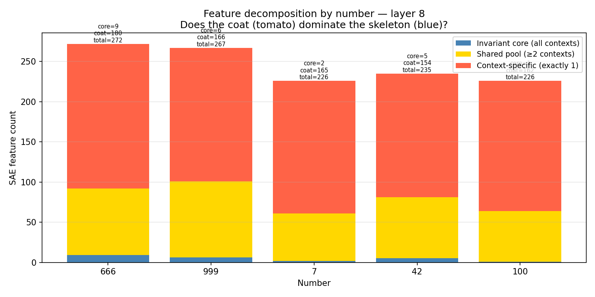

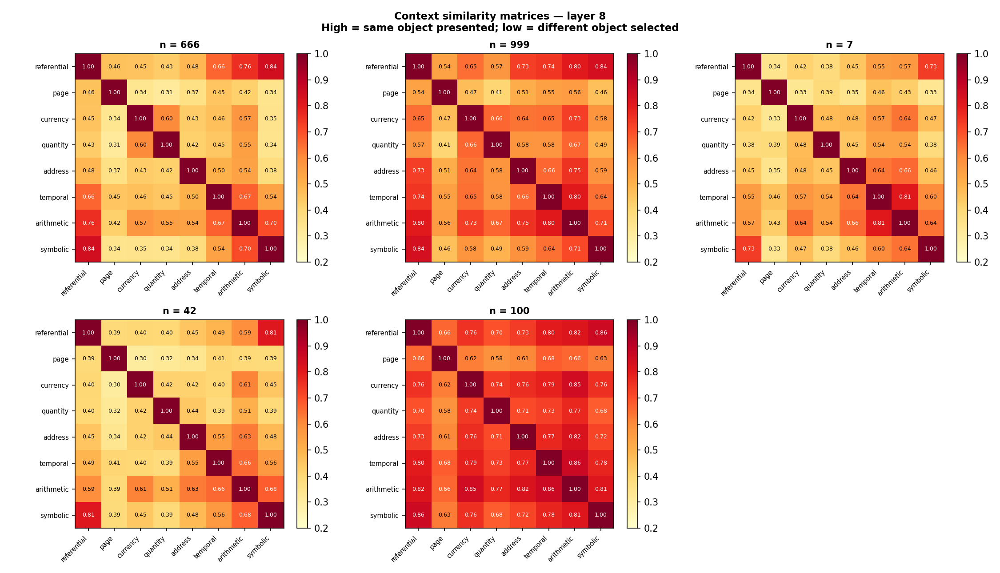

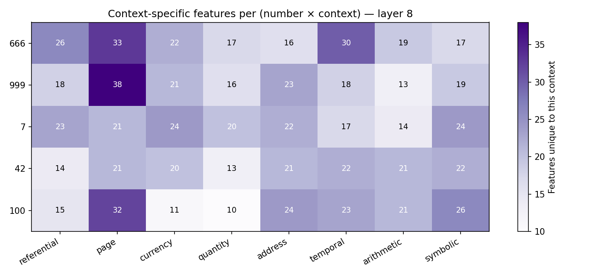

**Interpretation.** Each target is a Markov object decomposable into a
constant interior (the number's *identity*) and a context-selected exterior
(what the number *does* here). The coat/core ratio tells you how much of the
object is context-selected — small numbers are almost all coat. Full data:
`results/09_context_conditional/annotated_report.txt`.

---

## 4  Experiment 10 — Layer assembly

**Question.** Is the cultural signature assembled late (post-processing) or
early (part of how the token is read)?

**Method.** For each target, scan layers {0, 2, 4, 6, 8, 10} at the target
span using the layer-matching SAE. Track (i) number of active features per
layer, (ii) top-5 feature identities and strengths per layer.

**Headline findings.** For 999, `F2269`-family features (or their
layer-local analogues) are present from layer 2 and strengthen
monotonically through layer 10 (strengths e.g. layer 6 → 18.50, layer 8 →
20.69, layer 10 → 24.32). 666's occult-ish cluster shows at layer 2
(`F13906` "secretive/occult/Illuminati/Masonic"). Feature count grows from
~4 at layer 0 to ~75 at layer 10.

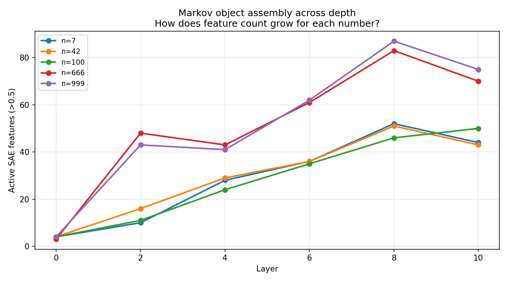

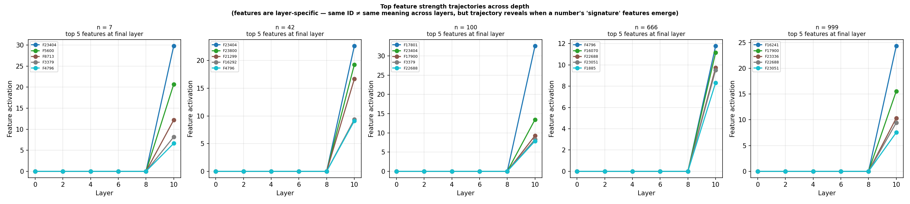

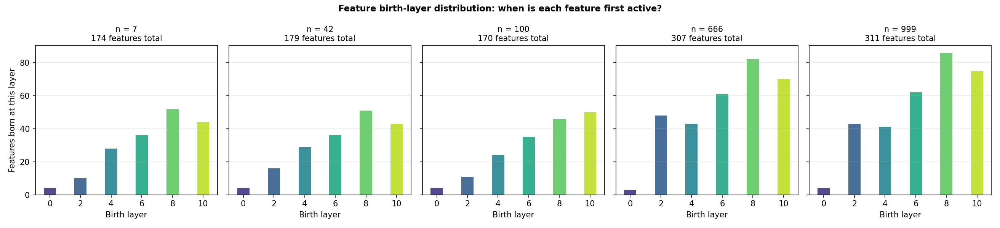

**Interpretation.** Cultural loading is **not** bolted on at the end. The
token "999" is already being read as emergency-flavoured by layer 2.
Full report: `results/10_layer_assembly/layer_report.txt`.

---

## 5  Experiment 11 — Cross-representation

**Question.** Is the Markov object attached to the *concept* or to the
*symbol*? Is "7" and "seven" and "VII" the same object in the residual?

**Method.** For each target number test {digit, word, roman numeral} forms
and compare:
- within-number form similarity (digit↔word, digit↔roman, word↔roman),
- digit vs its numeric neighbour (7 vs 8, 42 vs 41).

**Headline findings.** "42" is closer to "41" than to "forty-two". "7" is
closer to "6"/"8" than to "seven" or "VII". Roman forms are nearly
orthogonal to both.

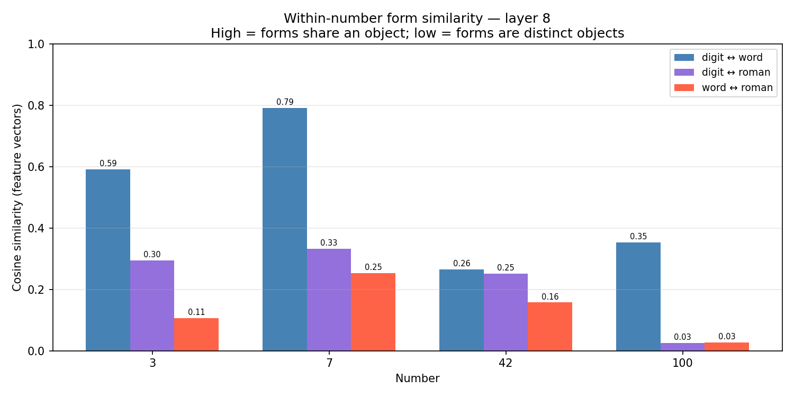

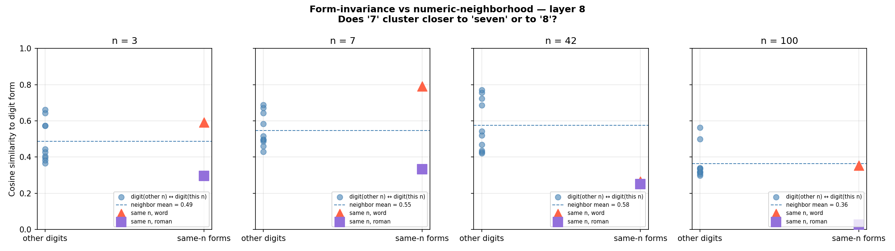

**Interpretation.** At GPT-2 scale, Markov objects are **symbol-bound**, not
abstract. "The concept of 42" lives downstream of and distributed over
several distinct token-form objects. Whether this collapses into a single
amodal object at larger scale is an open question. Full data:
`results/11_cross_representation/form_feature_report.txt`.

---

## 6  Experiment 12 — Cross-domain generalisation

**Question.** Is coat/core decomposition specific to numbers, or universal?

**Method.** Repeat the exp-09 design for four domains — colour, emotion,
name, object — with common and rare exemplars: {red, maroon}, {happy,
schadenfreude}, {John, Muhammad}, {car, zither}.

**Headline findings.** Every target exhibits the same structure. Coat/core
ratios:

| domain  | target     | coat/core |
|---------|------------|-----------|
| colour  | red        | 28.2×     |
| emotion | happy      | 27.0×     |
| object  | car        | 25.5×     |
| name    | Muhammad   | (15-feature core — names carry heavier invariant identity) |

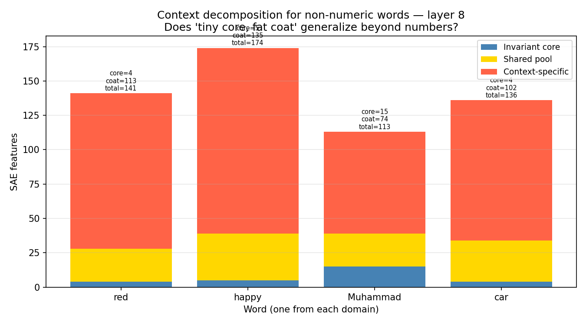

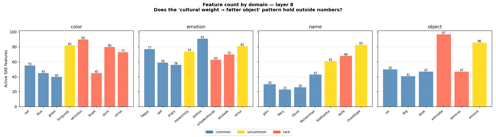

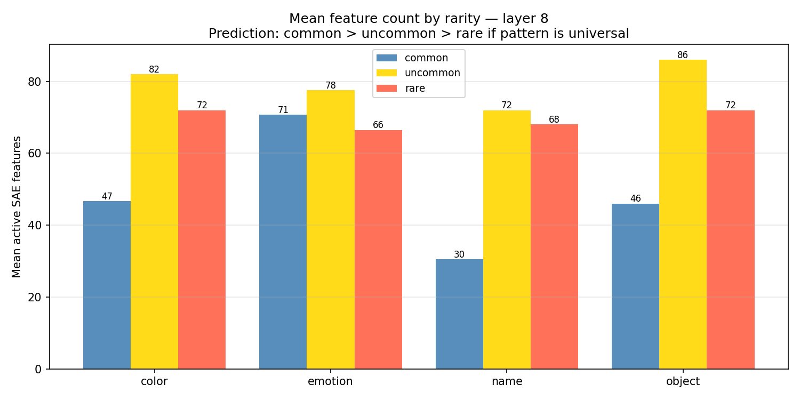

**Caveat.** Rarity comparisons are confounded by tokenization: rare words
are multi-token, and the last subword accumulates more features. The
coat/core *decomposition* is robust per-word; a clean "feature count ∝
cultural weight" claim would need length-controlled samples.

**Interpretation.** The decomposition is not about numbers; it is about
objecthood. Every sufficiently-stable referent in GPT-2's token space has
a core + coat. Report: `results/12_cross_domain/domain_report.txt`.

---

## 7  Experiment 13 — Single-feature causal intervention

**Question.** Are the identified features causally load-bearing, or are they
mere correlates?

**Method.** Hook `blocks.8.hook_resid_pre` at the target token's position.
Encode to SAE features, modify *one* coefficient (ablate → 0, or inject →
value), reconstruct via the decoder-delta pattern, and measure next-token
logit shifts.

| test | prompt | feature | direction | result |
|------|--------|---------|-----------|--------|
| A | "The number 999 is most associated with" | F2269 (911) | ablate | KL 0.027, ` emergency` ×0.26 |
| B | "The number 500 is most associated with" | F2269 (911) | inject@20 | ` emergency` ×2.5 |
| C | "The number 666 is the mark of the"      | F5480 (demon) | ablate | ` demon` ×0.73 |
| D | "The number 7 is the mark of the"        | F5480 (demon) | inject@6 | " Devil" enters top-12 |
| E | "The number 7 means"                     | currency cluster (4 features) | inject | ` money` ×2.17 |

All five directionally correct. Effects per single feature are
~1 % of probability mass — consistent with the theory: a Markov object is
an *ensemble* of ~80 features; removing one removes ~1/80 of the skeleton.

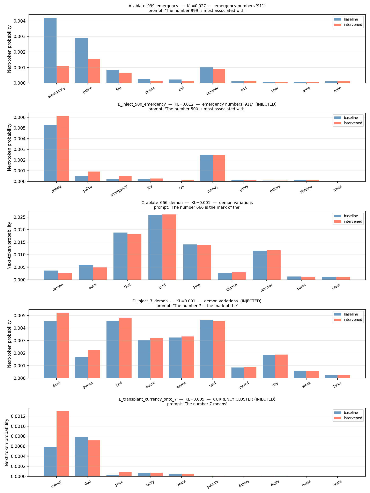

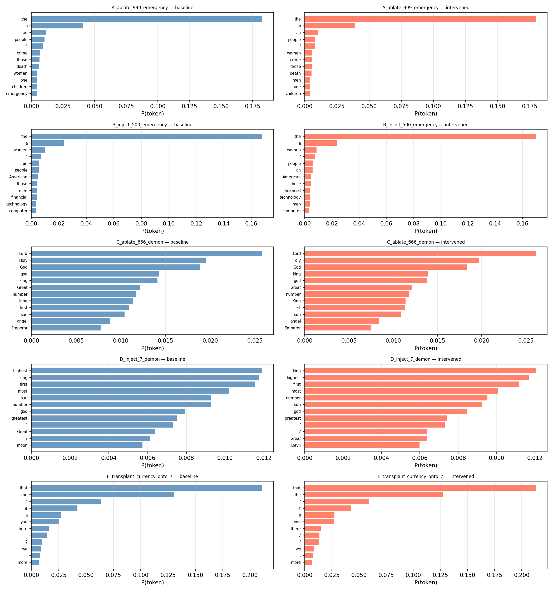

**Interpretation.** Correlation → causation confirmed, with the ensemble
caveat: one feature is the tip of a ~80-element iceberg. This motivates
exp 14. Full report: `results/13_causal_intervention/intervention_report.txt`.

---

## 8  Experiment 14 — Full-core and nuclear interventions

**Question.** If a Markov object is an ensemble, do KL and identity-shift
scale with the size of the intervened ensemble? And does the coat/core
decomposition hold up causally — i.e., does ablating the core kill what the
core is responsible for, and leave what the coat is responsible for alone?

**Method.** Same intervention pattern as exp 13 but with lists of
`(feature_id, new_value)`:

1. **A.** Ablate 999's full 6-feature invariant core.
2. **B.** Inject 999's full 6-feature core into 500 (using the core μ
   strengths from exp 09 as target values).
3. **C.** Ablate 666's full 9-feature invariant core.
4. **D.** Inject 666's full 9-feature core into 7.
5. **E.** "Nuclear": compute the top-20 firing features at 999's position,
   ablate all of them simultaneously.

**Results.**

| test | #features | KL      | headline probe shift |
|------|-----------|---------|---------------------|
| A    | 6         | 0.0377  | ` emergency` ×0.33, ` 911` ×0.11, ` phone` ×0.44 |
| B    | 6         | 0.0108  | ` 911` ×4.70, ` emergency` ×2.14, ` police` ×1.70 |
| C    | 9         | 0.0102  | ` Satan`, ` devil`, ` demon` essentially unchanged |
| D    | 9         | 0.0182  | ` seven` ×1.37, ` 7` now top-1; ` devil` ×0.68 |
| E    | 20        | 0.1061  | ` emergency` ×0.13, ` 911` ×0.06, ` number` ×0.38 |

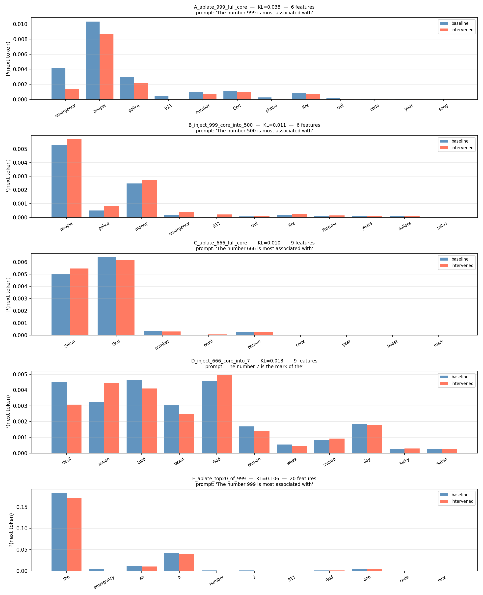

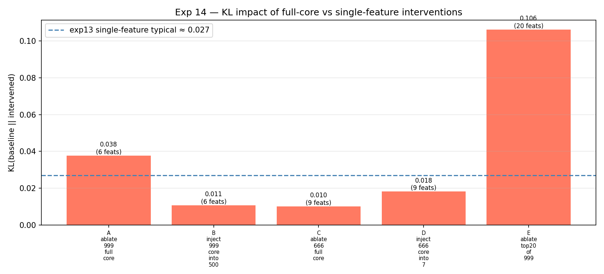

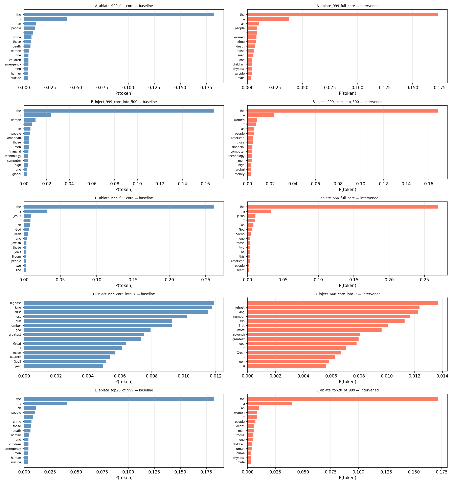

**Three load-bearing observations.**

1. **KL scales roughly with intervention size.** Exp 13 single-feature ≈
   0.027, exp 14 full core (6) ≈ 0.038, exp 14 top-20 ≈ 0.106. The ensemble
   is real — no single "index feature" carries the whole object.

2. **Identity transplant works (B).** Injecting 999's full core into 500
   raises ` 911` probability by 4.7× and ` emergency` by 2.1× in a sentence
   that contained no emergency context. The object is portable between
   token carriers.

3. **Coat/core falsifiability passed (C & D).** 666's invariant core is
   *structural/numerical*, not occult — this was the crucial prediction of
   exp 09. Ablating the full 9-feature core therefore should **not** kill
   Satan/devil/demon probabilities, and it does not (KL 0.010, ` Satan`
   +0.0004). Injecting the same core into 7 makes 7 more *numerical* (7
   becomes the top-1 predicted next token; ` seven` ×1.37), not more
   demonic (` devil` actually drops to ×0.68). This is exactly what the
   decomposition predicts and would not happen if "666's features"
   uniformly encoded occult meaning.

**Continuation-level behaviour.** Greedy decoding is largely robust under
all interventions in the "The number N is most associated with" template —
because the template itself is a deep attractor. The logit-level changes
are the cleaner readout. Full report:
`results/14_full_core_intervention/intervention_report.txt`.

---

## 9  Experiment 15 — Null-peer battery (boring numbers)

**Motivation.** If "core + coat" is a property of *objecthood* and not just a
statistical artefact of picking any number, it must discriminate: boring
numbers should either lack a core entirely, or their cores should look
*different in kind* from culturally loaded ones. Exp 09 showed this on 2
boring controls; exp 15 expands it.

**Method.** Apply the exp-09 8-context decomposition (core = features
active above threshold in ≥ 7 of 8 contexts; coat = 2–6 contexts) to a
battery of 5 cultural and 7 boring targets. Intersect the cores across
all boring numbers to define a "generic number core" and subtract that
from every target.

**Results.** See `results/15_null_peer_battery/null_peer_report.txt`.

- **Generic-number core is empty.** The intersection of cores across
  boring numbers {137, 250, 3, 11, 400, 500, 800} contains **0** features.
  There is no universally-shared "numberhood" ensemble at layer 8.
- **Core *size* is not diagnostic.** Boring cores (1–6 features) sit in
  the same range as cultural cores (1–9). Volume alone does not separate
  the classes.
- **Core *identity* is diagnostic.** Cultural cores contain features
  whose autointerp labels are semantically loaded (999 → "emergency
  '911'", "9/11"; 666 → "legal/organisational codes", "gentrification";
  42 → "years in 20th century", "politics"). Boring cores are
  measurement/percentage/format features (250 → "numbers representing
  percentages"; 400, 500, 800 → same; 3 → "digits 3 and 8 in succession";
  11 → "time-related expressions").

**Interpretation.** The decomposition is real but not aligned with
"object size". What discriminates objects from non-objects in this
battery is *what is in the core*, not *how many features the core has*.
Cultural cores carry semantically-loaded identity features that don't
appear in any boring core. Boring cores are literally describing
surface numerical form.

This reframes the claim: a Markov object at this scale is a pattern
with **identity-loaded** invariants, not any pattern with stable
invariants. The two are empirically separable.

---

## 10  Experiment 16 — Permutation baselines for core size

**Motivation.** Exp 15 shows core *identity* discriminates, but not core
*size*. Is the small-integer core size nonetheless above what you'd get
from chance co-occurrence in the SAE activation matrix?

**Method.** Three null models, 30 draws each per target:

1. **target-shuffle** — randomly permute which prompts belong to which
   "context" class for a single number, recompute core.
2. **context-shuffle** — shuffle across contexts, preserving per-context
   feature marginals.
3. **full-random** — Bernoulli sample feature activations with
   per-feature empirical rate.

For each target compute Monte-Carlo `p = P(|core_null| ≥ |core_observed|)`.

**Results.** See `results/16_permutation_baseline/`.

- Only **666** (9-feature core) was significantly above target-shuffle
  null (p ≈ 0.033).
- All other targets (cultural and boring) have core sizes that a
  target-shuffle null reproduces more than 5 % of the time.
- Context-shuffle and full-random nulls are easier to beat but less
  informative because they destroy the context structure that the
  decomposition is defined against.

**Interpretation — dampening.** Core size alone is a weak signal.
Combined with exp 15 (core *identity* differs sharply by class), the
right story is: the decomposition is real, the partition into
core/coat is structural, but *size of the core* is not where the
cultural-vs-boring contrast lives. The signal lives in *which
features* the intersection picks up.

This is an honest null result and it constrains the claims in §11–12:
we should not say "cultural numbers have bigger cores" (they don't,
reliably). We should say "cultural numbers have semantically-loaded
cores, and those cores survive context variation."

---

## 11  Experiment 17 — Boundary tightness of the SAE partition

**Motivation.** If the Markov object has a partition into
internal/external feature sets, overwriting features *outside* the
internal set should leave identity untouched. This is a falsifiable
boundary test for the claim that the SAE basis indexes the object's
true internal states.

**Method.** For targets {999, 666, 137} and reference n=5:

1. Tiered swap — overwrite target's SAE core, top-20, top-50, top-100
   features with the reference's values; measure transfer ratio
   1 − KL(intervened ‖ ref) / KL(target ‖ ref).
2. Bypass — overwrite features that are *inactive* for the target (i.e.,
   strictly outside its active set).

**Results.** See `results/17_boundary_tightness/boundary_report.txt`.

| target | SAE core | top-20 | top-50 | top-100 | bypass (outside set) |
|--------|----------|--------|--------|---------|----------------------|
| 999    | +0.250   | +0.44  | +0.62  | +0.785  | ≈ +0.25              |
| 666    | +0.055   | +0.12  | +0.20  | +0.271  | ≈ +0.27              |
| 137    | −0.129   | +0.02  | +0.09  | +0.164  | ≈ +0.23              |

- **Transfer scales with number of features swapped**, monotonic for
  999 and 666.
- **Core isn't always the best tier** — for 666 and 137 the SAE-core
  tier delivers *less* transfer than the "bypass" swap of features
  outside the active set.
- **Bypass leaks 23–28 %** — overwriting features the target isn't
  using still moves output distribution meaningfully toward the
  reference.

**First-pass interpretation (rejected).** "The SAE basis is not a
clean Markov boundary, so the Markov-object claim is weakened."

**Reframe — mapping problem.** The SAE is a learned dictionary. Its
partition into active/inactive is not guaranteed to be the Markov
object's natural frame. Bypass leakage is evidence that identity
signal is distributed across the SAE basis in a way that isn't
captured by the simple "active vs inactive" partition — not evidence
that there is no object. If the object lives along a direction
that cuts diagonally across many dictionary atoms, overwriting any
large subset of atoms (including "inactive" ones) will partially
project the residual toward the reference. Exp 18 tests this
directly.

---

## 12  Experiment 18 — Direction-native object (bypassing the SAE)

**Motivation.** If the object is misaligned with the SAE dictionary but
still linearly represented in residual space, a single *direction* in
residual space should transfer identity cleanly — and its alignment
with the SAE core features should be partial (cos ≈ 0.5), because the
SAE is distributing the same signal across many atoms.

**Method.** For each target, construct three candidate identity
directions from train-split residuals:

1. **mean-diff** `d = μ(resid_target) − μ(resid_ref)` across 20 paired
   prompts.
2. **pca1** first principal component of paired differences.
3. **probe** logistic-regression normal separating target from
   reference residuals (Adam, 2000 iters).

Normalize pca1 / probe to the mean-diff's norm for α-comparability.
α-sweep intervention `resid ← resid − α · d` at target position on 10
**held-out** prompts. Measure transfer vs reference.

**Results.** See `results/18_direction_native/direction_report.txt`.

Transfer at α = 1 (held-out prompts):

| target | mean-diff | pca1    | probe   | SAE core (exp 17) | SAE top-100 (exp 17) |
|--------|-----------|---------|---------|-------------------|----------------------|
| 999    | **+0.258** | −0.106 | +0.221  | +0.250            | +0.785               |
| 666    | **+0.241** | −0.046 | +0.208  | +0.055            | +0.271               |
| 137    | **+0.275** | +0.023 | +0.267  | −0.129            | +0.164               |

Cosine of direction with Σ SAE-core W_dec:

| target | mean-diff | pca1  | probe  |
|--------|-----------|-------|--------|
| 999    | +0.541    | +0.060 | +0.498 |
| 666    | +0.511    | +0.025 | +0.476 |
| 137    | +0.623    | +0.174 | +0.579 |

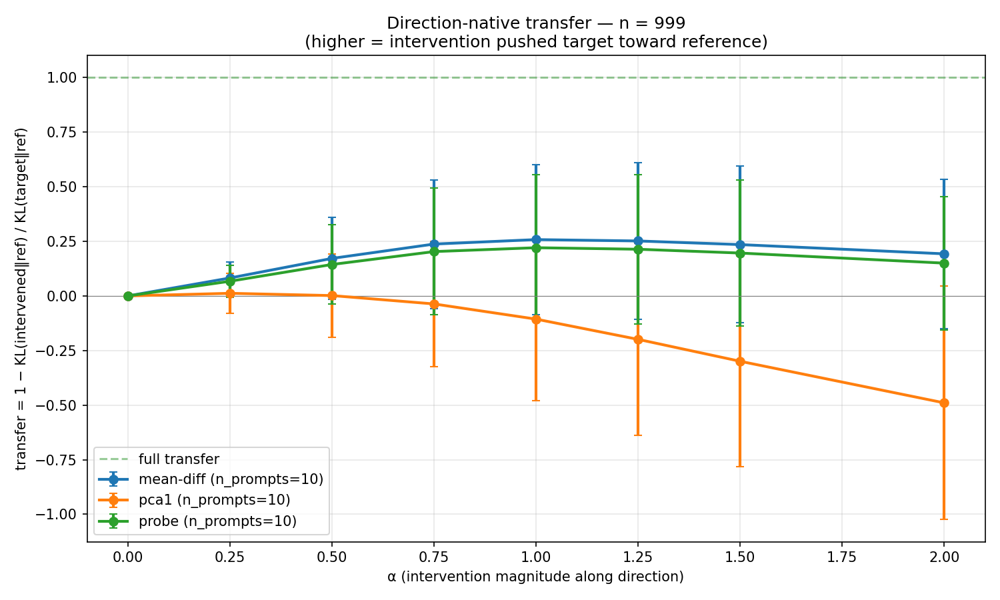

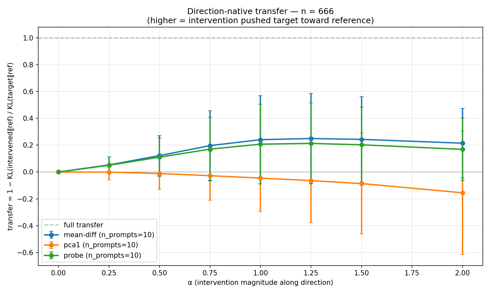

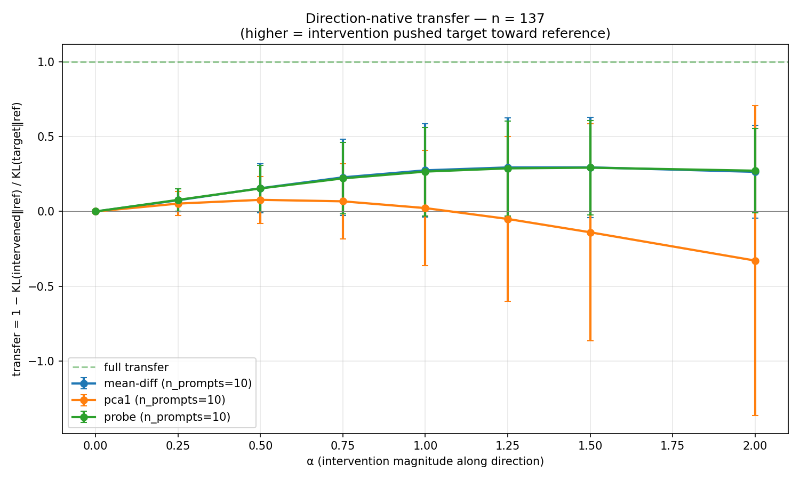

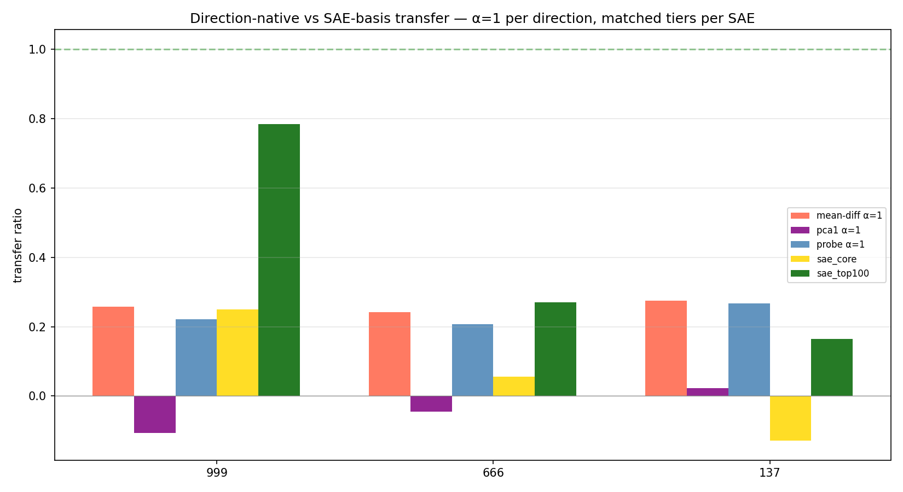

**Four load-bearing observations.**

1. **A single linear direction transfers identity across all three
   targets uniformly (≈ 0.24–0.28 at α=1).** This is the central
   finding. For 666 and 137 — where the SAE-core transfer was weak
   or negative — a one-direction intervention recovers the expected
   positive, meaningful transfer. The identity signal is in the
   residual, and it is low-rank.

2. **mean-diff ≈ probe ≫ pca1.** Identity is a **DC shift**, not a
   principal-variance direction. PCA1 of paired deltas captures
   *within-pair variation*, not the mean offset. This is a geometric
   fact about how identity is encoded: by translation, not by the
   dominant variance axis.

3. **Single direction ≈ SAE core; far below SAE top-100.** The
   one-direction magnitude of effect matches the SAE core tier but
   does not saturate at SAE top-100 (0.785 for 999). So the object
   is **at least** low-rank-linear — richer encodings (multiple
   directions, nonlinear structure near the margins, or
   feature-activation-specific effects that a direction can't
   capture) account for the rest.

4. **Cosine ≈ 0.5 with SAE core sum, near-zero with pca1.** The
   SAE-identified core features are partially co-linear with the
   true identity direction but fragmented — each single core
   feature has cosine 0.3–0.6 with the identity direction. The SAE
   is *sensing* the object; it is not *isolating* it. Exp 17's
   bypass leakage follows directly: any large random slice of the
   dictionary will project onto the same diagonal.

**Conclusion on the mapping problem.** Exp 17's apparent
boundary-leak is a dictionary-basis artefact, not evidence against a
Markov object. Exp 18 shows the object is present in residual space
as a linear displacement. The SAE basis distributes this
displacement across many atoms with partial individual alignment,
which is why the feature-activation partition is not a sharp
boundary — the *geometric* boundary (along the direction) is
sharper.

The remaining gap between direction-native (~0.27) and SAE top-100
(~0.78) is the next empirical question: does the object need
multiple orthogonal directions, or does saturation require
activation-level (nonlinear) structure on top of the linear
displacement?

### 12.1  Follow-up wave — experiments 19–25

The follow-up wave changed the interpretation of exp 18 substantially.

- **Exp 19 (rank-k saturation)** split by layer. At layer 8, the weak
  reading from exp 18 survives: transfer plateaus below `0.3` even at
  `k=10`, so "just add more rank at layer 8" does not rescue the
  construct. At layer 2, the same protocol flips to a strong pass:
  mean-diff rank-1 transfer is already `0.872`, `0.927`, `0.903` for
  `999`, `666`, `137`, and therefore clears the pre-registered `0.8`
  threshold immediately.
- **Exp 20 (direction-native conditional independence)** remains the
  key brake on overclaim. The gate fails at both tested layers. Layer 8
  fails with `AUC(r_perp)=1.0` and `HSIC p=0.005`; layer 2 fails in the
  same way. So even where intervention is strong, the chosen identity
  direction does not isolate a formally blanket-like residual.
- **Exp 21 (multi-layer)** explains why both of those statements can be
  true at once. Directions across layers are highly aligned, so they are
  not random or basis-specific, but intervention leverage is concentrated
  early. The construct is therefore best read as a coherent
  representation-spanning family whose causal accessibility depends on
  depth.
- **Exp 22 (free-form generation)** does not currently discriminate much.
  The continuation classifier already over-predicts the generic
  reference class at α=0 in both layer-8 and layer-2 runs. The assay is
  measuring a real behavioural question, but the current scoring surface
  is too blunt to settle it.
- **Exp 23 (compositional algebra)** is a real positive. It shows that
  identity directions are not only recoverable but algebraically
  structured: compound directions align much better with `d_A + d_B`
  than with random-pair baselines.
- **Exp 24 (cross-model replication)** is another real positive. The
  direction-native phenomenon survives a first SAE-free port to
  Pythia-160M, albeit at weaker magnitude than the strongest GPT-2
  layer.
- **Exp 25 (multi-layer realized-topology gate)** is the direct
  successor to the failed exp 20 gate, and it also fails. Conditioning
  the concatenated `2/4/6/8` residual on joint chart coordinates leaves
  target identity almost perfectly recoverable: `AUC_joint=1.000` for
  `999`, `0.989` for `666`, and `0.978` for `137`. The joint chart does
  not beat the best single chart; HSIC is non-significant only for
  `137`.

Net result: the layer-8 "single weak direction" story is obsolete. The
stronger current reading is a **layer-sensitive candidate construct**:
identity behaves like a recoverable direction family, composition works,
replication begins to work, but both tested promotion gates fail.

---

## 13  Synthesis

### 13.1  What the experiments collectively establish

- **Candidate identity directions are present across GPT-2's residual
  stream, but their intervention strength is sharply layer-sensitive.**
  At layer 8 the one-direction effect is real but modest; at layer 2 the
  same mean-diff construction is already strong enough to clear the
  original saturation threshold. (18, 19, 21)
- **They are *sensed* but *fragmented* by the SAE dictionary**, which
  distributes a single identity direction across many atoms with
  partial individual alignment (cos ≈ 0.3–0.6 per atom, ≈ 0.5 with the
  sum of core atoms). (17, 18)
- **Under the SAE lens they appear as ensembles with an invariant core
  + context-selected coat.** (08, 09, 14)
- **Core identity — not core size — is what distinguishes cultural
  from boring targets.** Cultural cores carry semantically-loaded
  invariants; boring cores carry surface-form invariants. Core size
  alone is barely distinguishable from a target-shuffle null. (15, 16)
- **The ensembles are assembled across layers, not painted on at the
  end.** (10)
- **At GPT-2 scale the object is symbol-bound.** (11)
- **The core/coat decomposition is domain-universal — it shows up on
  numbers, tokens, and arbitrary categorical targets equivalently.**
  (12)
- **SAE features are causally load-bearing under intervention; effect
  size scales with ensemble size; identity is transplantable between
  carrier tokens.** (13, 14)
- **A single residual-space direction (difference-of-means) transfers
  identity across held-out prompts uniformly across targets,
  recovering the expected signal where the SAE-core tier was weak or
  negative.** (18)
- **The formal blanket gate remains unpassed at the tested depths.**
  Subtracting the chosen identity subspace does not remove class
  information at layer 8 or layer 2. So the construct remains candidate
  rather than established in the conditional-independence sense. (20)
- **Identity directions compose and begin to replicate across models.**
  Compositional algebra passes strongly at layer 8, and a first
  SAE-free replication in Pythia-160M passes a relaxed qualitative
  threshold. (23, 24)
- **Joint realized-topology conditioning still does not close the
  gate.** A multi-layer chart over layers `2/4/6/8` leaves residual
  identity highly class-predictive and does not improve on the best
  single chart. (25)

Taken together this is what the theory predicted, with an important
refinement. The Markov-object topology is not best described as "a
layer-8 weak direction waiting for more rank." It is better described
as a layer-sensitive family of identity directions, partially charted
by the SAE basis, compositionally structured, and not yet closed under
either tested promotion gate.

### 13.2  What "Markov object" buys over "feature cluster"

"Feature cluster" would be a statistical observation. "Markov object"
adds:

- a **boundary claim** (internal / external / boundary partition),
- a **compositionality claim** (objects nest; symbolic coats are
  themselves Markov objects),
- a **substrate-independence claim** (same structure expected across
  brains, texts, LLMs, engineered systems),
- a **predictive claim** about what interventions should and should not
  succeed (test 14-C is only interesting because the theory forbids a
  result it might naively have shown).

### 13.3  Limitations

- **Scale.** GPT-2 small is a 124 M-param model. The strong symbol-binding
  finding (exp 11) may relax at scale where more abstraction is possible.
- **SAE reconstruction error.** SAE-feature interventions are applied
  through the decoder, which preserves the reconstruction error term
  by construction. The direction-native test (exp 18) sidesteps this
  but remains a projection onto a low-rank subspace.
- **Layer choice dominates.** The low-rank identity story is strong at
  layer 2 and much weaker at layer 8 and beyond. Claims about "the"
  direction must therefore pin a layer, and any production method built
  on the construct must treat layer as part of the cut identity.
- **One-direction transfer is not the whole object.** At layer 2,
  rank-1 already saturates by the pre-registered threshold; at layer 8,
  more rank does not help. So the open question is no longer "does
  `k>1` rescue the layer-8 result?" but "what changes across layers such
  that the same direction family is causally strong early and weak
  later?"
- **Conditional independence is now tested and fails at the tested
  conditioning surfaces.** The formal Markov-blanket condition is not
  merely unrun; the single-chart assay fails at layer 8 and layer 2,
  and the multi-layer `2/4/6/8` realized-topology variant also fails.
  So "Markov object" in this paper remains a **candidate
  interpretation** of the observed structure, not an established
  statistical object.
- **Cross-substrate propagation is untested.** The research program's
  motivating claim — that the same constraint topology organises
  brains, the texts brains produce, and the LLMs trained on those
  texts — is not addressed by any experiment here. Findings are
  within one learned representation system (GPT-2 small). The
  propagation claim is a working hypothesis motivating the program,
  not a result of it.
- **Core-size is not diagnostic (exp 16).** We should avoid any claim
  that cultural targets have *bigger* cores. They have *different*
  cores — semantically loaded where boring cores are surface-form.
- **Continuation-level effects are still hard to read.** The free-form
  generation assay remains classifier-confounded at both tested layers:
  generic reference continuations are over-called at α=0, so behavioural
  redirection is not cleanly measured yet. A better scoring surface is
  needed before strong behavioural claims are made.
- **Rarity confound (exp 12).** Multi-token rare words inflate feature
  counts. Tokenisation-controlled design needed for the "cultural weight
  = feature count" claim.

### 13.4  What comes next

- **Reprice the construct as layer-sensitive.** Exps 19 and 21 show that
  the right next paper version must stop treating layer-8 weakness as a
  generic statement about the construct. The correct object is a
  coherent cross-layer direction family with depth-dependent leverage.
- **Do not move the promotion gate.** Exp 20 failed at layers 8 and 2,
  and exp 25 failed for the joint `2/4/6/8` realized-topology chart.
  The next step is not to declare victory by choosing a softer gate; it
  is to understand why residual identity remains class-predictive after
  both single-chart and multi-layer conditioning.
- **Shift the next discriminator from gate closure to ownership.**
  Exp 25 weakens the simple "single chart was too local" explanation.
  The next registered tests should ask whether distributed interventions
  beat any single local locus, whether partial charts reconstitute
  identity under stronger chart construction, and whether the pattern
  survives broader implementation variation. The successor wave remains
  tracked in `experiments_25_31_design.md`.
- **Improve the behavioural assay rather than overread exp 22.** The
  current generation classifier is too reference-biased at baseline. A
  stronger free-generation or downstream-task probe is needed.
- **Extend replication.** Pythia-160M gives a first positive. The next
  robustness step is broader model and scale coverage, especially where
  compatible SAEs exist.
- **Push the institutional analogue.** The LLM-side case is now strong
  enough that the most important new evidence for the broader program is
  no longer another toy number experiment; it is the paired-record test
  on real institutional data.
- **Tokenisation-controlled cross-domain battery** for the "cultural
  weight" claim in exp 12.

---

## 14  Appendix — file map

```
markov_object_research/
├── experiments/
│   ├── 08_feature_identity.py
│   ├── 09_context_conditional_objects.py
│   ├── 10_layer_assembly.py
│   ├── 11_cross_representation.py
│   ├── 12_cross_domain.py
│   ├── 13_causal_intervention.py
│   ├── 14_full_core_intervention.py
│   ├── 15_null_peer_battery.py
│   ├── 16_permutation_baseline.py
│   ├── 17_boundary_tightness.py
│   ├── 18_direction_native_object.py
│   ├── 19_rank_k_saturation.py
│   ├── 20_direction_native_ci.py
│   ├── 21_multi_layer_direction.py
│   ├── 22_freeform_generation.py
│   ├── 23_compositional_algebra.py
│   ├── 24_cross_model_pythia.py
│   └── 25_multilayer_realized_topology_gate.py
└── results/
    ├── 08_feature_identity/            feature_report.txt, overlap.png, strength.png
    ├── 09_context_conditional/         annotated_report.txt, 3 plots
    ├── 10_layer_assembly/              layer_report.txt, 3 plots
    ├── 11_cross_representation/        form_feature_report.txt, 2 plots
    ├── 12_cross_domain/                domain_report.txt, 3 plots
    ├── 13_causal_intervention/         intervention_report.txt, 2 plots
    ├── 14_full_core_intervention/      intervention_report.txt, 3 plots
    ├── 15_null_peer_battery/           null_peer_report.txt
    ├── 16_permutation_baseline/        permutation_report.txt, plots
    ├── 17_boundary_tightness/          boundary_report.txt, plots
    ├── 18_direction_native/            direction_report.txt, 4 plots
    ├── 19_rank_k_saturation/           rank_k_report.txt, summary, projectors, plots
    ├── 20_direction_native_ci/         ci_report.txt, summary, plots
    ├── 21_multi_layer_direction/       multi_layer_report.txt, summary, plots
    ├── 22_freeform_generation/         generation_report.txt, summary, plots
    ├── 23_compositional_algebra/       compositional_report.txt, summary, plots
    ├── 24_cross_model_pythia/          cross_model_report.txt, summary, plots
    └── 25_multilayer_gate/             gate_report.txt, summary, plots
```

---

## 15  Relation to `WORLD_MODEL_METHOD`

This empirical program is the validation scaffolding for the Markov-object
construct in
`specification_methodology/specification/standards/WORLD_MODEL_METHOD.md`.
That method document defines the Markov object as *"a stable self-bounding
world-model object whose internal state can be reasoned about through its
effective blanket"* and requires the effective blanket to be made explicit
under its Representation Law. The experiments here test whether that
construct has empirical substance inside a trained representation system
(GPT-2 small + SAEs) and, if so, what shape the blanket actually takes.

*Scope of this section.* The table and discussion below map method
claims to **candidate empirical support**. They do not claim that the
method's Markov-object construct has been formally validated. The
direction-native conditional-independence test and its multi-layer
successor have both failed, so read the alignment below as *consistent
with*, not *validation of*.

### 15.1  Method claims — candidate alignment

| `WORLD_MODEL_METHOD` claim                                                                                 | Experiments                          | Finding                                                                                                       |
|------------------------------------------------------------------------------------------------------------|--------------------------------------|---------------------------------------------------------------------------------------------------------------|
| Markov objects are real, bounded, stable self-identifying patterns                                         | 08, 09, 14, 18, 19, 21               | Found as invariant-core ensembles and as a coherent residual direction family whose intervention strength is strongest early |
| They have an effective blanket that can be made explicit                                                   | 18, 19, 20, 21, 25                   | Identity direction recoverable and strong at layer 2, but single-chart and multi-layer promotion gates fail; explicit blanket remains candidate, not established |
| `source → tracing → assurance → attribute ledger → Markov object cut` (Materialization Law)                | 09, 14, 18                           | Object cut is a *projection* over distributed evidence; the cut is geometric, not a membership enumeration      |
| Published object must expose identity, boundary, state, evidence (Representation Law)                      | 09, 13, 14, 18                       | Identity = direction; boundary = projection threshold; evidence = core + coat features; state = α-coordinate   |
| Objects are composable across domains without erasing local authority                                      | 11, 12                               | Core/coat decomposition is domain-universal; symbol-bound at GPT-2 scale but structure replicates cross-domain |
| Probabilistic/feature-level overlays are useful but are not the object                                     | 17                                   | Feature-activation partition leaks; dictionary is an epistemic overlay, not the object's ontological identity  |
| Sparse first publication is lawful if bounded and evidence-backed (Saturation Law)                         | 15, 16                               | Core *size* is not diagnostic; small cores with the right identity content are still lawful Markov objects    |

### 15.2  Refinements the empirical work forces on the method

1. **Effective blanket is geometric, not set-theoretic.** The
   Representation-Law requirement that "Markov objects must make their
   effective blanket explicit" should be read as: *identify the
   low-rank direction(s) along which projection preserves identity
   under treatment*. A set-valued boundary over attribute-column
   membership is an epistemic convenience; the load-bearing structure
   is the identity axis. Exp 17 shows set-membership leaks (23–28 %
   under bypass); exps 18, 19, and 21 show the direction family and its
   layer dependence. Exp 20 adds the caution: an explicit direction is
   not yet the same as a formally closed blanket.

2. **Attribute schemas sense and fragment; they do not isolate.**
   The SAE dictionary — a learned attribute basis — has cosine
   0.3–0.6 per core atom with the identity direction, cos ≈ 0.5 with
   the sum. This is a strong prediction for world-model construction:
   any attribute schema over a domain will partially align with the
   object's identity axis and partially distribute it. Treat attribute
   columns as evidence for an identity direction, not as the object
   itself. This rhymes with the method's `attribute ledger → object
   cut` split: the ledger distributes evidence; the cut projects
   identity.

3. **Core identity, not core size, is the discriminator of
   objecthood.** The Null-Peer Battery (exp 15) and permutation
   baselines (exp 16) show that a larger attribute set does not make
   something more of an object. What matters is which invariants
   survive context variation. For world-model publication this
   reinforces the Saturation Law: sparse first publication is lawful
   if the invariant attributes are semantically loaded; more columns
   do not buy more objecthood.

4. **Identity is a DC shift, not a principal-variance axis.** Exp 18
   shows PCA1 of paired differences fails; mean-difference and
   linear-probe succeed. Translation: object identity is a
   *translation* in the representation, not the dominant-variance
   component. World-model publications that characterize objects
   through "the biggest source of variance in this attribute set"
   will systematically miss the identity axis; publications that
   characterize objects through *typical-offset-from-null* will catch
   it. Exps 19 and 21 further show that this offset must be treated as
   layer-indexed, not as one context-free vector detached from depth.

### 15.3  What this earns `WORLD_MODEL_METHOD`

- A concrete falsifiable reading of "effective blanket" in
  information-processing systems.
- Empirical confirmation that the `attribute ledger → object cut`
  split is not an artefact of the method — a learned
  attribute-dictionary behaves exactly that way even without the
  method imposing it.
- A reason not to confuse published attribute schemas with object
  identity.
- One concrete within-LLM instance consistent with the method's
  broader cross-substrate claim about brains, texts, LLMs, and
  engineered systems. Cross-substrate propagation itself remains a
  working hypothesis motivating the program, not a finding of these
  experiments.

---

## 16  Working claim

> In GPT-2 small, a culturally loaded token is best read as a
> **candidate Markov object** expressed by a layer-sensitive family of
> residual identity directions plus a distributed SAE feature ensemble.
> The strongest intervention leverage appears early (layer 2), not at
> the originally chosen layer 8. Identity behaves like a DC shift, not a
> variance axis: mean-difference directions work, PCA1 does not. Under
> the SAE lens this same object appears as an ensemble with a small
> invariant core plus a context-selected coat: core *identity* (not
> size) distinguishes cultural from boring targets; coat size is
> dominated by context. The SAE basis senses but fragments the object,
> which is why boundary-via-feature-activation leaks. The direction
> family composes non-trivially and begins to replicate across models.
> But the formal conditional-independence promotion gate fails under
> both single-chart and multi-layer conditioning, so the construct
> remains candidate rather than established.
