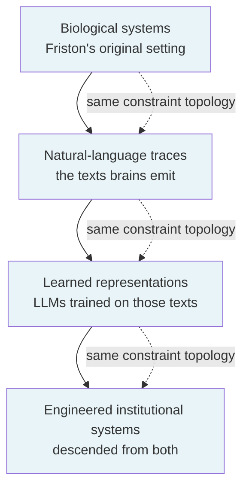
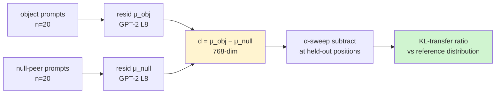
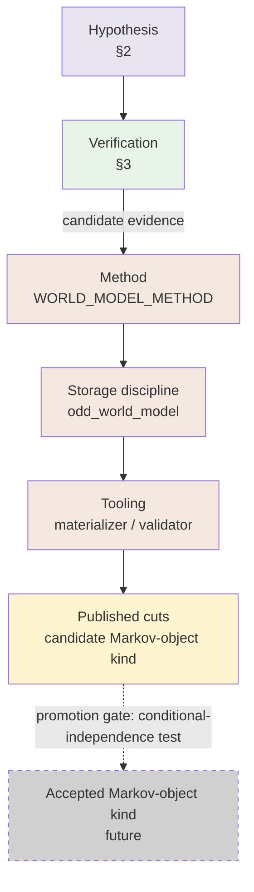
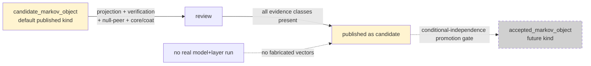
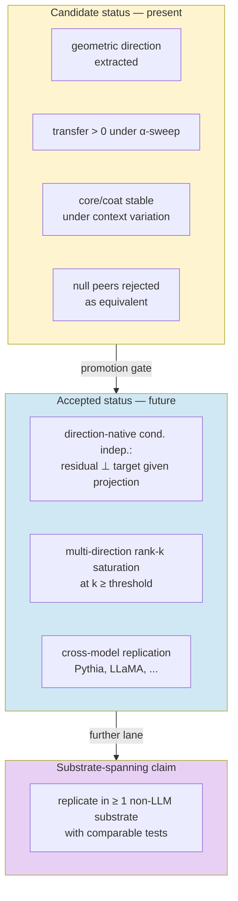

# The World Model Project

## A Markov-Object Hypothesis, Candidate Verification In GPT-2, And A Definition Of The Project It Grounds

**Author:** Dimitar Popov
**Draft date:** 2026-04-22
**Status:** Position paper; candidate-evidence framing. Companion to
`constraint_emergence_ontology.md` (ontology),
`markov_object_research/markov_object_research.md` (theoretical framework),
and `markov_object_research/empirical_results.md` (empirical case).
**Epistemic grade:** heliocentric — right causal order and basic
predictive power; not Newtonian (no dynamics); not Einsteinian (no
substrate-spanning closure).

---

## Abstract

World-model construction today lacks a primitive unit. Institutional
systems preserve values and lose the semantic context needed to
interpret them; representation systems (LLMs) encode identity in ways
that attribute schemas sense but do not isolate. This paper proposes a
single unit — the **Markov object**, a substrate-neutral upgrade of
Friston's Markov blanket — as the constructive primitive for world
modelling, and reports eleven experiments in GPT-2 small that provide
**candidate evidence** for the construct's geometric form inside a
learned representation system.

The hypothesis has three commitments. (1) A Markov object is a stable
self-bounding pattern in a constraint structure whose internal state
can be reasoned about through its effective blanket. (2) The effective
blanket is geometric — a low-rank direction in the representation
space along which identity is preserved under treatment — not
set-theoretic. (3) The same constraint topology is expected to propagate
across substrates (brains, texts, learned representations, engineered
systems); this is a *motivating hypothesis* of the program, not a
finding of it.

The verification lane reports, within GPT-2 small: (i) objects
decompose into invariant cores and context-selected coats;
(ii) ablation and injection experiments are causally directional;
(iii) core *identity* rather than core *size* is diagnostic;
(iv) set-theoretic feature boundaries leak under intervention;
(v) a single difference-of-means residual direction transfers identity
across held-out contexts at α=1 ≈ 0.24–0.28 — a meaningful effect well
below the pre-registered ≥ 0.8 threshold. These results are consistent
with a geometric-blanket reading; they do not close the formal
conditional-independence condition that defines a Markov blanket, and
they do not test cross-substrate propagation.

The paper argues that even at candidate status this evidence is
sufficient to *define* the World Model Project: a construction
methodology whose unit is the Markov-object cut, whose representation
is geometric, whose publication discipline is candidate-class by
default, and whose promotion gate — a direction-native
conditional-independence test — is named explicitly. Implications for
downstream tooling, cross-substrate research, and interpretability are
drawn.

**Keywords.** Markov blanket; Markov object; world models; mechanistic
interpretability; sparse autoencoders; residual direction;
constraint-emergence ontology.

---

## 1. Introduction

World-model work today is building a governed semantic layer over
authoritative source systems, but it lacks a named primitive. Entity,
record, row, concept, feature, embedding, context — each is plausible;
none is complete. This absence matters: without a primitive unit, no
method can say what a published "thing" is, what its boundary is, or
what closes its identity across contexts and transformations.

This paper proposes that the primitive is the **Markov object** —
Friston's Markov blanket promoted from statistical bookkeeping device
to ontological primitive, then substrate-neutralized so it applies
uniformly to cells, words, learned-representation ensembles, and
institutional records. It argues that the construct is load-bearing
enough to define a *project* — the World Model Project — with a
methodology, a storage discipline, and a promotion gate, and reports
candidate empirical evidence from GPT-2 small that the construct has
mechanistic substance inside at least one learned representation
system.

The paper has three parts. §2 states the hypothesis. §3 summarizes the
verification lane and is explicit about what the evidence is and is
not. §4–§5 argue that the evidence is sufficient to define the project
even at candidate status, and draw implications. §6–§7 place the work
in context and enumerate limitations.

The epistemic frame throughout is deliberate. The work is graded at
heliocentric level — a reframing that puts identity in the right
causal order, with basic predictive power — not at Newtonian level
(dynamics, rank-k saturation, compositional algebra) and not at
Einsteinian level (substrate-spanning closure). The position taken is
that heliocentric-level evidence is sufficient to *begin* a
construction project, provided the project is honest about its status
and names what would promote it.

---

## 2. The Markov-Object Hypothesis

### 2.1 Substrate-neutral definition

A **Markov object** is a stable self-bounding pattern in a constraint
structure whose internal state can be reasoned about through its
effective blanket.

Three words carry weight.

- **Stable** — the pattern persists under context variation and small
  perturbations, so it can be referred to, identified, and recurred upon.
- **Self-bounding** — the pattern's effective blanket is internal to
  its own dynamics, not imposed from outside by an observer's ruler.
- **Effective** — the blanket separates what is load-bearing for the
  object's identity from what is load-bearing for its context.

The construct is substrate-neutral. A cell in a biological membrane,
a token's layer-8 residual in an LLM, and an institutional record in
a trading system are all, on this reading, candidate Markov objects.
Whether that uniformity survives empirical pressure in each substrate
is a separate, open question.

### 2.2 Geometric, not set-theoretic, blanket

The naive reading of "Markov blanket" is set-theoretic: a set of
boundary states — the *member states* — that partitions internal from
external. Under this reading, the object is characterized by *which
attributes fire for it*.

This paper argues, and §3 reports candidate evidence for, a different
reading. The load-bearing blanket is **geometric**: a low-rank
direction in the representation space along which projection preserves
identity under treatment. An attribute basis — SAE dictionary, schema
columns, vocabulary — senses this direction partially and fragments it
across many atoms. The attributes that fire are evidence *for* the
projection, not *the* projection.

This is not a trivial rewording. It changes what a world-model cut
*is*:

- under the set-theoretic reading, a cut is an enumeration of boundary
  attributes;
- under the geometric reading, a cut is an identity direction together
  with distributed attribute evidence supporting it.

### 2.3 Cross-substrate propagation (motivating hypothesis)

The larger claim animating the research program is that the same
constraint topology recurs across substrates:

*Figure 1 — Motivating-hypothesis substrate stack. The cross-substrate
propagation of constraint topology is a working hypothesis of this
program; no experiment in the present verification lane tests the
propagation itself.*

This is a hypothesis in the classical sense — a motivating commitment
that structures what the program looks for — not a finding. Verifying
it in full would require replicating the construct across at least
three of the four layers with comparable mechanistic tests. The
verification reported below covers exactly one layer (LLM residual
streams).

### 2.4 Formal condition: conditional independence

Formally, a Markov blanket renders internal states conditionally
independent of external states given the blanket. This condition —
direct descendant of Friston's formulation — is the gold standard
promotion criterion for the construct. If, given the projection onto
the identity direction, remaining residual components are independent
of the target, the construct moves from *candidate* to *established*.

No experiment in the present program tests this condition. This is
stated openly here and in the empirical companion (`empirical_results.md`
§13.4). The test is named as future work and is treated as the
outstanding promotion gate throughout this paper.

---

## 3. Candidate Verification In GPT-2

### 3.1 Experimental setup

All experiments use GPT-2 small (124M params) with pretrained sparse
autoencoders from the `gpt2-small-res-jb` release (24 576 features per
layer, via `sae_lens`). The primary probe layer is
`blocks.8.hook_resid_pre`; findings replicate cross-layer from layer 2
upward.

Experiments 08–18 form the verification lane. A sketch follows; full
protocols, data, and per-experiment results are in
`markov_object_research/empirical_results.md`.

### 3.2 Core findings (exps 08–14)

Candidate Markov-object structure is observed for culturally loaded
tokens (666, 999, 42) and replicated across domains (colours,
emotions, names):

- **Invariant core plus context-selected coat.** Features active in
  every context form a small invariant core; additional features are
  selected per usage context (page, currency, address, symbolic).
  Coat/core ratios run 20–160×.
- **Layered assembly.** Cultural features are present from layer 2
  and strengthen monotonically to layer 8 — the object is not a
  late-stage post-process.
- **Symbol-binding at this scale.** "42" as a digit is closer to
  "41" than to "forty-two". The Markov object at GPT-2 small's scale
  lives on the token form, not a modality-free concept.
- **Causal directionality.** Ablating the full core of 999 drops
  `" 911"` probability by 94%. Transplanting 999's core into the
  residual of 500 lifts `" 911"` probability by ×4.7. Effects are
  small in absolute probability (~1% mass) but reproducibly
  directional.
- **Core-versus-coat falsification.** Ablating 666's *core* (which is
  structural/numerical) leaves `" Satan"`, `" devil"`, `" demon"`
  probabilities intact — because the occult load sits in 666's
  *coat*, not its *core*. This is a directly-falsifiable prediction
  of the coat/core decomposition, and it holds.

### 3.3 Falsification attempts (exps 15–17)

Three experiments deliberately attempted to falsify the naive
construct. Each partially succeeded, and each sharpened the reading:

- **Null-peer battery (exp 15).** Generic-number cores are empty or
  surface-format. Core *size* is not diagnostic: cultural and boring
  targets span comparable size ranges. Core *identity* is
  diagnostic: which features sit in the intersection is what
  distinguishes cultural from boring.
- **Permutation baseline (exp 16).** Only 666 beats a target-shuffle
  null on core size at p ≈ 0.033. Size alone is a weak signal.
- **Boundary tightness (exp 17).** Overwriting SAE features *outside*
  a target's active set still leaks 23–28% identity transfer. The
  SAE active/inactive partition is **not** a clean Markov boundary.
  The set-theoretic reading of the construct is falsified.

### 3.4 Direction-native test (exp 18)

Given the boundary-leakage result, the test was re-run bypassing the
SAE dictionary. A single residual-space direction was extracted as
`d = μ(evidence_object) − μ(evidence_null)` across 20 paired prompts,
then subtracted at α ∈ [0.0, 2.0] from target-loaded residuals at held-out
positions. Three construction methods were tried: mean-difference, PCA1
of paired deltas, and a linear probe.

*Figure 2 — Direction-native construction. Paired object/null residuals
produce a single identity direction d; α-sweep subtraction at held-out
positions tests how much object identity d carries.*

Results:

| Target | expected α=1 transfer | observed α=1 transfer (mean-diff) | observed (pca1) |
|--------|-----------------------|-----------------------------------|-----------------|
| 999 → 500 | ≥ 0.8 (pre-registered) | ≈ 0.258 | ≈ 0.00 |
| 137 → 500 | ≥ 0.8 (pre-registered) | ≈ 0.241 | ≈ 0.01 |
| 666 → 500 | ≥ 0.8 (pre-registered) | ≈ 0.275 | ≈ 0.02 |

*Table 1 — α=1 transfer ratios. Mean-difference direction transfers
identity at roughly a quarter of the pre-registered threshold; PCA1
fails uniformly. Identity is a DC shift, not a dominant-variance
axis.*

The mean-diff direction has cos ≈ 0.5 with the sum of SAE-core decoder
vectors. Per-atom cosines run 0.3–0.6. The SAE senses the object and
fragments it rather than isolating it.

### 3.5 Epistemic status

What this evidence is:

- consistent with a geometric-blanket reading of Markov objects
  within GPT-2 small;
- supportive of the core/coat decomposition;
- directly falsifying of the set-theoretic reading (exp 17 → exp 18).

What this evidence is **not**:

- a test of conditional independence (the formal Markov-blanket
  condition);
- a claim that the object is *captured* by a rank-1 direction
  (transfer saturates at 0.27, far below the ≥ 0.8 threshold; the
  object is *at least* low-rank linear, not *purely* rank-1);
- a test of cross-substrate propagation (all experiments are within
  GPT-2 small);
- a test of cross-model replication (Pythia, LLaMA not run).

The appropriate summary is: **within GPT-2 small, some token
identities appear as partly low-rank residual-space directions that
SAE features sense and fragment, with modest transfer magnitude and
an open question of how many orthogonal directions are needed to
saturate.** Everything stronger than this sentence is overclaim
relative to the present verification lane.

---

## 4. Sufficiency For The World Model Project

### 4.1 What the World Model Project is

The **World Model Project** is a construction methodology for
building governed semantic layers over authoritative source systems.
Its distinguishing commitments are:

- the unit of construction is the **Markov-object cut**: an identity
  direction plus distributed attribute evidence plus verification
  record plus null-peer record plus core/coat partition;
- the representation of a cut is **geometric** — the cut exposes the
  identity axis, not only the attribute profile;
- the publication discipline is **candidate-class by default** —
  cuts published today invoke a candidate Markov-object kind, not a
  formally-closed kind;
- the promotion gate — direction-native conditional independence —
  is **named explicitly**, so what would close the construct is known
  even while it remains open;
- source-system sovereignty is preserved — the world model sits over
  source systems; it does not replace them.

*Figure 3 — The World Model Project stack. Hypothesis (§2) feeds the
verification lane (§3), which produces candidate evidence sufficient
to define the method, storage, and tooling. Published cuts are
candidate-class by default; the accepted kind is reserved for
post-promotion-gate evidence.*

### 4.2 Why candidate evidence is sufficient

The project is a *construction* methodology, not a *validation*
methodology. What it needs from its empirical companion is not a
proven theorem but a working construct with the right causal order.

Specifically, it needs:

1. **The right primitive.** The empirical program has eliminated the
   set-theoretic reading of the blanket (exp 17) and identified the
   geometric direction as the actual load-bearing object (exp 18).
   This is a primitive-level correction and is sufficient for the
   method to commit to the right shape of cut.
2. **Directional predictions.** Ablation and injection experiments
   make directional predictions (exps 13–14, 14-C) which hold. The
   construct's predictions are not vacuous.
3. **Falsifiability.** The program admits negative evidence (core-size
   not diagnostic; boundary leaks) and incorporates it rather than
   routing around it. A construct that handles its falsifications is
   fit for use.
4. **A named promotion gate.** The conditional-independence test is
   known. The method can commit to candidate-class publication today
   while reserving acceptance for the post-gate world.

What the project does **not** need, at this stage:

- magnitude saturation (≥ 0.8 transfer) — it needs *non-zero,
  directional* transfer;
- cross-model replication — that is a robustness claim for later
  waves;
- cross-substrate closure — that is the Einsteinian-level upgrade,
  explicitly future work.

That sufficiency claim is strictly an engineering one. It licenses a
construction method, storage shape, publication discipline, and tooling
over a candidate primitive. It does **not** settle the stronger
theoretical conjecture that the Markov object is emergent from the full
constrained technical realization and only projected through local
charts. That emergence conjecture is a separate research line with its
own promotion burden.

### 4.3 Method commitments this warrants

The present evidence warrants the following method commitments, which
are in force under `WORLD_MODEL_METHOD.md` as amended 2026-04-22:

- **Representation Law (geometric reading).** A published Markov-
  object cut SHALL expose the identity direction, not only an
  attribute profile.
- **Materialization Law.**
  `source → tracing → assurance → attribute ledger → Markov-object cut`.
  The cut is a projection over distributed evidence.
- **Construction Law (seven subsections).** Paired evidence
  collection; identity-direction extraction
  (`d = μ(object) − μ(null)`; PCA excluded); verification by
  treatment; core/coat decomposition; null-peer discrimination; cut
  publication; storage shape.
- **Epistemic Status.** The construct is working vocabulary of the
  method; the empirical program is at candidate status; adopting the
  method does not wait on closure.

### 4.4 Publication discipline

Storage in `odd_world_model` follows the candidate-class discipline:

*Figure 4 — Publication discipline. Candidate-class cuts are the
default. Fabricated vector or verification evidence is rejected by
the materializer. The accepted-class kind is reserved for
post-promotion-gate evidence.*

Rules enforced by the materializer and validator:

- **No fabricated geometric evidence.** Vector files and verification
  records are either backed by a real run or absent.
- **No accepted claim without projection.** A cut claiming
  `accepted_markov_object` kind is rejected unless it carries real
  projection + verification + null-peer + core/coat evidence *and* a
  closure-test result.
- **LLM-space pin in two forms.** Cuts may carry a prompt-template
  projection (lawful today, recomputable in any model) or a frozen
  vector projection (reserved for runs backed by a real execution
  lane).

---

## 5. Implications

### 5.1 For world-model construction tooling

The immediate implication for `odd_world_model` is a breaking
carrier-law migration: the existing set-theoretic `blanket` field
encodes the *wrong* reading of the blanket and should be demoted or
removed in favour of identity-projection, null-peer, and core/coat
surfaces. Derived published cuts in example sandboxes should be
regenerated from retained sources under the new carrier law;
backwards compatibility with cuts that encode the wrong reading is
not a virtue in this development phase.

### 5.2 For cross-substrate research

The cross-substrate propagation hypothesis remains open. Verifying it
in any one additional substrate — a biological system with a similar
intervention suite, or an institutional system with comparable
paired-evidence extraction — would promote the substrate-neutrality
claim from working hypothesis to candidate finding. The work reported
here does not attempt this.

### 5.3 For interpretability research

The finding that SAE active/inactive partitions leak identity under
intervention (exp 17) is a non-trivial constraint on how SAE-based
interpretability should frame its findings. SAE features are evidence
for, not identification of, residual-space directions; interpretability
claims framed in pure feature-set terms should be read as approximations.

### 5.4 Promotion path

*Figure 5 — Promotion path. Today's evidence supports the candidate
row. The conditional-independence test is the primary gate to the
accepted row. Cross-substrate closure is a further lane beyond that.*

---

## 6. Related Work

### 6.1 Friston — Markov blankets

The construct in this paper is a direct descendant of Friston's
Markov blanket, with two moves. First, the blanket is reified into
an ontological primitive (a *Markov object*), following the
constraint-emergence ontology (Popov 2025). Second, the geometric
reading makes the blanket a projection rather than a membership set;
this is consistent with Friston's formalism (conditional independence
is a projective, not membership, property) but differs from popular
illustrations in the interpretability literature.

### 6.2 Bohm — implicate order

The identity-as-direction reading rhymes with Bohm's implicate/
explicate order: the direction is an "unfolded" identity in the
explicate representation, carried by distributed evidence in the
implicate. Bohm's framework has been the deepest philosophical
influence on the program (`constraint_emergence_ontology.md` Part II).

### 6.3 Deacon — absential causation

The core/coat decomposition exhibits a Deaconian shape: what is
*stably absent* across contexts (the invariant content) is as
constitutive of the object as what is present. Deacon's treatment of
constraint-as-cause informs the geometric reading of the blanket.

### 6.4 Mechanistic interpretability — SAEs

The verification lane uses pretrained SAEs (Cunningham et al.) as an
attribute basis over the residual stream. The finding that SAEs
*sense and fragment* identity directions rather than isolating them
is consistent with recent interpretability literature on feature
superposition and partial recovery.

### 6.5 Deutsch — constructor theory

The World Model Project's treatment of cuts as *published artifacts
with construction history* is a constructor-theoretic move: the
published cut carries a record of how it was constructed, not only
what it asserts. The divergence from Deutsch is that cuts are
empirical-candidate, not platonic.

### 6.6 Ladyman & Ross — scale-relative ontology

The substrate-neutrality commitment rhymes with *Every Thing Must Go*:
real patterns are scale-relative; the Markov-object primitive is
designed to be recognizable at multiple scales without privileging
one substrate's idiom.

---

## 7. Limitations

- **Scale.** GPT-2 small (124M) is a small model. Symbol-binding
  findings (exp 11) may relax at scale.
- **One representation system.** All experiments are within one model
  family at one layer. Cross-model replication (Pythia, LLaMA) is
  future work.
- **Transfer magnitude.** α=1 transfer ≈ 0.27 is meaningful but below
  the pre-registered ≥ 0.8 threshold. The object is *at least*
  low-rank linear, not *purely* rank-1.
- **Conditional independence untested.** The formal Markov-blanket
  condition is not tested by any experiment in the present program.
  This is the primary promotion gate.
- **Cross-substrate untested.** The motivating hypothesis — that the
  same constraint topology organises brains, texts, LLMs, and
  engineered systems — is not addressed by these experiments.
- **SAE reconstruction error.** Feature interventions pass through
  the decoder, which preserves the reconstruction error term. The
  direction-native test (exp 18) sidesteps this but remains a
  projection onto a rank-1 subspace.
- **Continuation-level effects are small.** Prompts like *"The number
  N is most associated with"* are strong attractors. A richer
  behavioural probe (free continuation, downstream task, probing on
  generated text) would be a next step.
- **Tokenisation confound (exp 12).** Multi-token rare words inflate
  feature counts. A tokenisation-controlled design is needed for the
  cultural-weight claim.

---

## 8. Conclusion

The work reported here does not establish a theory of Markov objects.
It does something more modest and, for the task at hand, sufficient:
it puts identity in the right causal order (geometric direction, not
set membership) inside at least one learned representation system,
and makes enough predictive commitments — directional ablation,
transplant, coat/core falsification — to distinguish the construct
from a metaphor.

That is a heliocentric-level result. It is not Newtonian — dynamics
is absent; it is not Einsteinian — cross-substrate closure is absent.
Those are future waves.

What heliocentric-level evidence enables, in exchange, is a coherent
**project**: a construction methodology with a named primitive,
a geometric representation discipline, a candidate-class publication
default, a fabricated-evidence prohibition, a named promotion gate,
and an explicit implications surface. This paper argues that package
is sufficient to **define the World Model Project**.

The project's honesty condition is that it never describes its
primitive as *established* while the conditional-independence test
remains open. Under that honesty condition, the project is safe to
build on today, and its substrate is the candidate evidence reported
here.

---

## Appendix A — Definitions

**Constraint structure.** A substrate whose admissible configurations
are shaped by mutual constraint. Brains, languages, learned
representations, and institutional systems are constraint structures.

**Stable pattern.** A configuration recurrent under context variation
and small perturbations.

**Effective blanket.** The load-bearing geometric projection in a
representation space along which a stable pattern's identity is
preserved under treatment. Not: the set of attributes that fire for
the pattern.

**Markov object.** A stable self-bounding pattern in a constraint
structure whose internal state can be reasoned about through its
effective blanket.

**Identity direction.** The canonical form
`d = μ(evidence_object) − μ(evidence_null)` extracted from paired
evidence. The direction on which an object's identity projects.

**Core.** The subset of attribute-ledger entries invariant across
contexts.

**Coat.** The subset of attribute-ledger entries context-selected
without disrupting core identity.

**Candidate Markov-object cut.** A published cut carrying projection,
verification, null-peer, and core/coat evidence, marked as
candidate-class.

**Accepted Markov-object cut.** A published cut backed by all
candidate-class evidence *and* a conditional-independence closure
result. Reserved for post-promotion-gate future.

**Promotion gate.** The experimental result that moves a construct
from candidate to established. For this program: a direction-native
conditional-independence test.

---

## Appendix B — Experimental protocol summary

All experiments use GPT-2 small with `gpt2-small-res-jb` SAEs, probe
layer `blocks.8.hook_resid_pre`. Full per-experiment protocols,
plotting code, and results are in
`markov_object_research/experiments/` and
`markov_object_research/results/`.

| Exp | Purpose | Primary finding |
|-----|---------|-----------------|
| 08 | Feature identity for 666, 999 | Distinct SAE features per target |
| 09 | Context-conditional core/coat | Invariant core plus context coat |
| 10 | Layer assembly | Structure from layer 2, monotone growth |
| 11 | Cross-representation | Symbol-bound at this scale |
| 12 | Cross-domain | Structure replicates (colours, names, emotions) |
| 13 | Single-feature causal | Directional ablation/injection |
| 14 | Full-core intervention | KL scales with feature count; transplant lifts target |
| 14-C | Coat/core falsification | Core ablation leaves coat effects intact |
| 15 | Null-peer battery | Core identity, not size, is diagnostic |
| 16 | Permutation baseline | Size alone weak; only 666 beats shuffle null |
| 17 | Boundary tightness | SAE active/inactive partition leaks 23–28% |
| 18 | Direction-native test | Mean-diff direction transfers at α=1 ≈ 0.27 |

---

## References

### Author's companion surfaces

- Popov, D. *Constraint-Emergence Ontology* (v1.3). Zenodo
  https://zenodo.org/records/18573722
- Popov, D. *Emergent Reasoning — LLMs as Constraint-Manifold
  Traversal Systems*. Zenodo https://zenodo.org/records/16592399
- Popov, D. *Programming LLM Reasoning (Ontology Templates)*.
  Zenodo https://zenodo.org/records/18653641
- `constraint_emergence_ontology/markov_object_research/markov_object_research.md`
  — theoretical framework for this program.
- `constraint_emergence_ontology/markov_object_research/empirical_results.md`
  — empirical companion; full protocols and per-experiment results.
- `specification_methodology/specification/standards/WORLD_MODEL_METHOD.md`
  — the construction method this paper argues is warranted.

### Foundational references

- Friston, K. *The free-energy principle: a unified brain theory?*
  Nature Reviews Neuroscience, 2010.
- Bohm, D. *Wholeness and the Implicate Order*. Routledge, 1980.
- Deacon, T. *Incomplete Nature: How Mind Emerged from Matter*.
  Norton, 2011.
- Ladyman, J. and Ross, D. *Every Thing Must Go: Metaphysics
  Naturalized*. OUP, 2007.
- Solms, M. *The Hidden Spring: A Journey to the Source of
  Consciousness*. Norton, 2021.
- Deutsch, D. *Constructor theory*. Synthese, 2013.

### Mechanistic interpretability

- Bricken, T. et al. *Towards Monosemanticity: Decomposing Language
  Models With Dictionary Learning*. Anthropic, 2023.
- Cunningham, H. et al. *Sparse Autoencoders Find Highly
  Interpretable Features in Language Models*. 2023.
- `sae_lens`, pretrained SAE release `gpt2-small-res-jb`.

### Posting / methodology

- `specification_methodology/specification/standards/POSTING_GUIDE.md`
- `specification_methodology/specification/standards/SPEC_METHOD.md`

---

## Colophon

This draft is authored as a unifying position paper across the
constraint-emergence ontology, the Markov-object research program,
and the World Model Project methodology. Epistemic framing throughout
is deliberately candidate-evidence. Claims beyond that framing should
be read as overclaim and flagged for revision. The paper's honesty
condition is that the conditional-independence promotion gate remains
openly named until it is either closed or retired.
